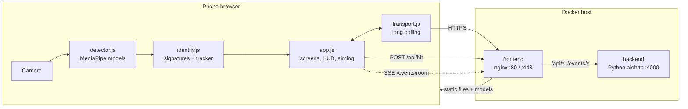
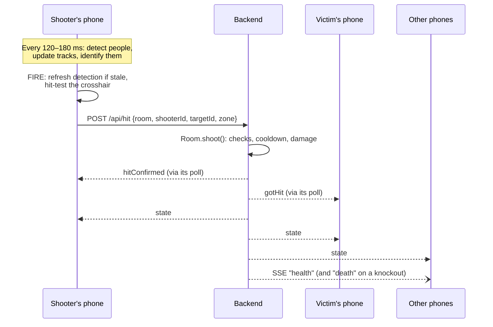

# Architecture

## Overview

The game has two halves:

- **The phone client** (`public/`) does all the heavy lifting: camera, person detection, player identification, aiming and the UI.
- **The game server** keeps the shared state honest and in sync: who's in the room, HP, the countdown and the winner. It never sees camera frames, only small messages like "player A hit player B in the head".

## Components

| Component | Location | Responsibility | Docs |
| --- | --- | --- | --- |
| UI and game loop | `public/app.js`, `index.html`, `style.css` | Screens, camera, render loop, scanning, shooting, HUD | [App flow](client/app-flow.md) |
| Transport | `public/transport.js` | Long-polling connection to the server | [Networking](client/networking.md) |
| Detection | `public/detector.js` | Runs MediaPipe models, produces person boxes and hitboxes | [Detection](client/detection.md) |
| Identification | `public/identify.js` | Appearance signatures, gallery matching, multi-frame tracker | [Identification](client/identification.md) |
| Sound | `public/sound.js` | Synthesised sound effects | [Feedback](client/feedback.md) |
| Models | `public/models/` | EfficientDet-Lite0, Pose Landmarker Lite, MobileNetV3 embedder | [Detection](client/detection.md#models) |
| Python backend | `backend/app.py` | Production game server | [Python backend](server/python-backend.md) |
| Node dev server | `server/` | Local dev server and test target | [Node dev server](server/node-dev-server.md) |
| nginx frontend | `frontend/` | Static files, TLS, reverse proxy | [Docker setup](operations/docker.md) |

## Data flow for one shot

The shooter's phone decides *whether* the shot hit and *who* was hit. The server checks that the shot is legal (round running, both alive, not yourself, cooldown passed) but trusts the identification. That's a deliberate trade-off for a hackathon game and means a modified client could cheat.

## Why HTTP polling instead of WebSockets

All realtime traffic uses ordinary HTTP:

- **Long polling** (`/api/poll`) for room state and personal messages.
- **POST** (`/api/send`, `/api/hit`) for actions.
- **Server-Sent Events** (`/events/<room>`) for room-wide health and death events.

This works unchanged through reverse proxies, SSO gateways, Cloudflare tunnels and self-signed local HTTPS, which were all part of the hackathon's hosting setup. There is no WebSocket code path. See [Networking](client/networking.md) and [Protocol](server/protocol.md).

## Two backend implementations

The same protocol and game rules are implemented twice:

| | Python (`backend/app.py`) | Node (`server/`) |
| --- | --- | --- |
| Used by | Docker and production | `npm start` / `npm run dev`, and all automated tests |
| Serves static files | No (nginx does) | Yes |
| TLS | No (nginx does) | Yes, self-signed via `selfsigned` |
| Game rules | `Room` class in the same file | `server/game.js` |
| Protocol | aiohttp handlers in the same file | `server/realtime.js` |

They're meant to behave identically. **Any change to rules or the protocol has to be made in both**, and the tests only cover the Node version. See [Contributing](development/contributing.md#keep-both-backends-in-sync).

## State: who owns what

| State | Owner | Notes |
| --- | --- | --- |
| Rooms, players, HP, wins, status, countdown | Server, in memory | Lost on restart. No database. |
| Player galleries (scans) | Server, in memory | Sent to every phone in the room as the roster. |
| Camera frames, detections, tracks | Each phone | Never leave the device. |
| Name, room, own scan, active lobby | Phone `localStorage` | Lets a phone rejoin after a reload. |
