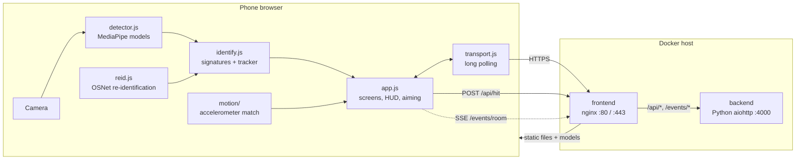
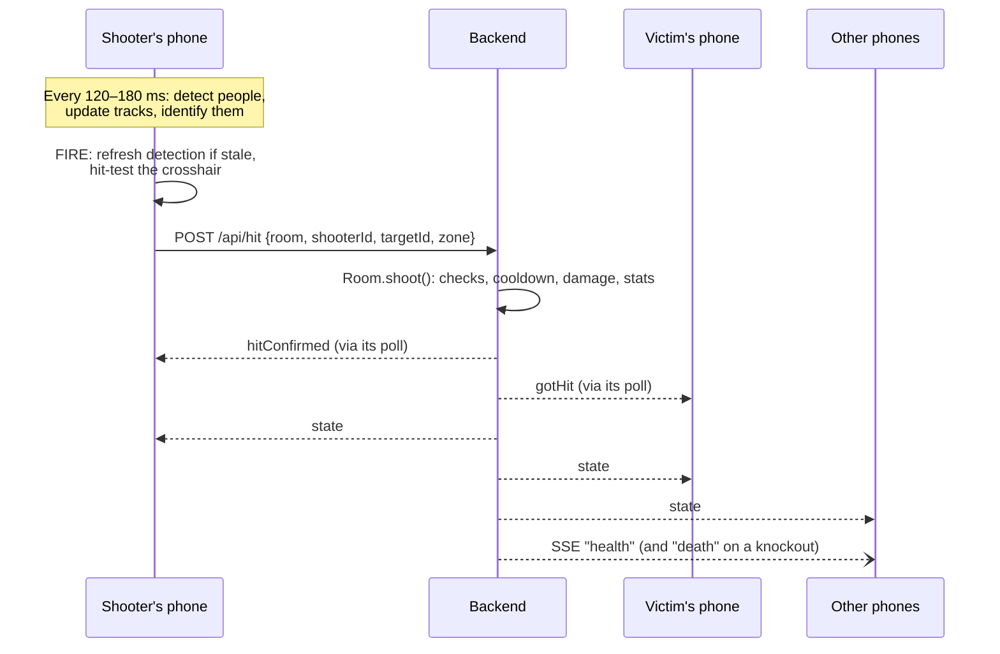

# Architecture

## Overview

The game has two halves:

- **The phone client** (`frontend/public/`) does all the heavy lifting: camera, person detection, player identification, aiming and the UI.
- **The game server** keeps the shared state honest and in sync: who's in the room, HP, the countdown and the winner. It never sees camera frames, only small messages like "player A hit player B in the head".

## Components

| Component | Location | Responsibility | Docs |
| --- | --- | --- | --- |
| UI and game loop | `frontend/public/app.js` (entrypoint), `frontend/public/state.js`, `frontend/public/env.js`, `frontend/public/roster.js`, `frontend/public/camera.js`, `frontend/public/net.js`, `frontend/public/screens/*.js`, `index.html`, `style.css` | Screens, camera, render loop, scanning, shooting, HUD | [App flow](client/app-flow.md) |
| Who is that person? | `frontend/public/identity.js` (the seam), `frontend/public/appearance-identity.js` (default), `frontend/public/motion-identity.js` (`?motion=on`/`?motion=strict`) | One identity provider is installed at load and answers every "who is this" question; nothing else in the app knows which signals decide | [App flow](client/app-flow.md#who-counts-as-a-target) |
| Transport | `frontend/public/transport.js` | Long-polling connection to the server | [Networking](client/networking.md) |
| Detection | `frontend/public/detector.js` | Runs MediaPipe models, produces person boxes and hitboxes | [Detection](client/detection.md) |
| Identification | `frontend/public/identify.js` | Appearance signatures, gallery matching, multi-frame tracker | [Identification](client/identification.md) |
| Re-identification | `frontend/public/reid.js` | OSNet person re-identification embeddings in ONNX Runtime Web; the strongest identification signal when it loads | [Identification](client/identification.md#the-re-identification-embedding-reidjs) |
| Motion matching | `frontend/public/motion/sensor.js`, `frontend/public/motion/matching.js` | Optional (`?motion=on`/`?motion=strict`): phones share accelerometer activity so a tracked person's on-screen motion can confirm or veto who the classifier thinks they are | [Identification](client/identification.md#motion-confirmation-motion) |
| Sound | `frontend/public/sound.js` | Synthesised sound effects | [Feedback](client/feedback.md) |
| Models | `frontend/public/models/` | EfficientDet-Lite0, Pose Landmarker Lite, MobileNetV3 embedder, OSNet x0.25 | [Detection](client/detection.md#models) |
| Python backend | `backend/` (`app.py` entrypoint, `models.py`, `transport.py`, `sanitize.py`) | The only game server - production, and local dev | [Python backend](server/python-backend.md) |
| nginx frontend | `frontend/` | Static files, TLS, reverse proxy | [Docker setup](operations/docker.md) |

## Data flow for one shot

The shooter's phone decides *whether* the shot hit and *who* was hit. The server checks that the shot is legal (round running, shooter alive, not yourself, cooldown passed) but trusts the identification. A shot that hit nobody is posted too, with no `targetId`: it only counts toward the shooter's stats, and nothing else follows from it. That's a deliberate trade-off for a hackathon game and means a modified client could cheat.

## Why HTTP polling instead of WebSockets

All realtime traffic uses ordinary HTTP:

- **Long polling** (`/api/poll`) for room state and personal messages.
- **POST** (`/api/send`, `/api/hit`) for actions.
- **Server-Sent Events** (`/events/<room>`) for room-wide health and death events.

This works unchanged through reverse proxies, SSO gateways, Cloudflare tunnels and self-signed local HTTPS, which were all part of the hackathon's hosting setup. There is no WebSocket code path. See [Networking](client/networking.md) and [Protocol](server/protocol.md).

## One backend (there used to be two)

`backend/` (Python) is the only server implementation - game rules in `backend/models.py`,
protocol in `backend/app.py`/`backend/transport.py`. A second, Node implementation
(`server/game.js` + `server/realtime.js`) used to exist purely so `npm start`/`npm run dev` could
run the whole game without Docker; it's archived under `deprecated/server/` (see
[Streamlining](streamlining.md)) and no longer built, run, or tested.

That archiving briefly made things worse before it made them better: the Node implementation's
tests (now `deprecated/server/*.test.js`) were the only automated coverage this game's rules and
protocol ever had, and they tested the Node copy, not the Python one that's actually deployed.
`backend/test_models.py` and `backend/test_protocol.py` port that coverage to the real backend -
see [Testing](development/testing.md). What's still missing: CI doesn't run either test suite
before deploying - see [Streamlining](streamlining.md).

## State: who owns what

| State | Owner | Notes |
| --- | --- | --- |
| Rooms, players, HP, wins, status, countdown | Server, in memory | Lost on restart. No database. |
| Player galleries (scans) | Server, in memory | Sent to every phone in the room as the roster. |
| Camera frames, detections, tracks | Each phone | Never leave the device. |
| Motion activity | Each phone, relayed by the server | One number per 100 ms per phone. The server only forwards it to the other players in the room and keeps no history. |
| Name, room, own scan, active lobby | Phone `localStorage` | Lets a phone rejoin after a reload. |
