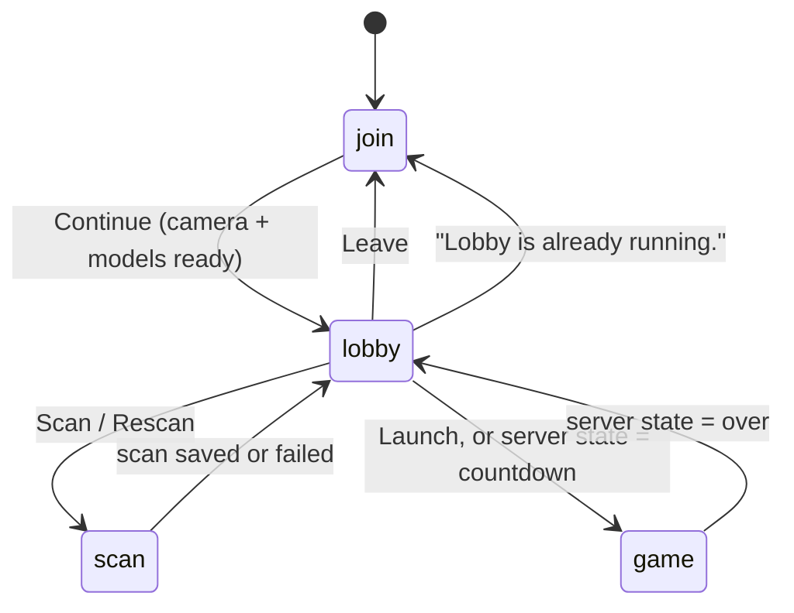

# App flow and screens

`public/app.js` is now just the entry point: it wires DOM events to the four screens and resumes an active lobby on load. Everything it used to own directly has moved into focused modules:

| Module | Used for |
| --- | --- |
| `env.js` | URL-parameter flags (`DEBUG`, `REQUIRE_MOTION`, `MOTION_OFF`), `$()`, and the shared `video`/`canvas`/`ctx` |
| `state.js` | The one shared `state` object and the `localStorage` helpers |
| `roster.js` | Read-only lookups over the server's roster/game snapshot |
| `camera.js` | Starting the camera and the on-device models, once |
| `motion-identity.js` | All phone-motion plumbing plus `resolveIdentity()` - the one seam where motion fusion decides who a track is (see [Shooting](#who-counts-as-a-target) below) |
| `net.js` | Reconnect/resume and what each server message does to the screens, built on `transport.js`'s long-polling connection |
| `screens/join.js` | The join form and camera/model startup |
| `screens/lobby.js` | Lobby list, launch, leave |
| `screens/scan.js` | The rotation scan: recording, scoring, outlier/duplicate removal, the cache |
| `screens/game.js` | The frame loop, overlay, HUD/countdown and shooting |
| [`detector.js`](detection.md) | Creating the MediaPipe models and finding people in frames |
| [`identify.js`](identification.md) | Signatures, matching and the `Tracker` |
| [`reid.js`](identification.md#the-re-identification-embedding-reidjs) | The OSNet person re-identification embedding, the strongest identification signal when it loads |
| [`motion/sensor.js`](identification.md#what-each-phone-shares-motionsensorjs) | This phone's own accelerometer/gyroscope activity |
| [`motion/matching.js`](identification.md#motion-confirmation-motion) | Checking a tracked person's on-screen motion against each player's phone, and fusing that with the classifier |
| [`sound.js`](feedback.md) | Sound effects |

`public/index.html` contains all four screens as sibling `<main>` elements; only one is visible at a time. A single `<video>` element and an overlay `<canvas>` are shared by the scan and game screens, so the camera is only requested once.

## Screens

`state.mode` tracks the current screen: `'join' | 'lobby' | 'scan' | 'game'`.

### Join (`#join-screen`)

- Pre-fills name and room from `localStorage`, or the room from a `?room=` URL parameter. The default room is `demo`.
- On **Continue**: unlocks audio, asks for motion-sensor access (`startMotion()` — it has to happen inside the tap, because that's the only place iOS will show the prompt), starts the rear camera (`facingMode: environment`, ideally 1280×720) and loads the models in parallel (`prepareCameraAndDetector`): the MediaPipe detector/pose/embedder plus the [re-identification model](identification.md#the-re-identification-embedding-reidjs). A re-identification failure is caught and logged — the game continues on the colour signature, and the delegate label loses its `+ReID` suffix.
- Failures show a friendly message (`startupErrorMessage`): not HTTPS, permission denied, no camera, or the raw error.
- On success: switches to the lobby, requests a screen wake lock, starts the render loop and opens the connection.
- Refused motion access doesn't block anything; `startMotion()` is retried on the first **FIRE** press, which also covers an automatic rejoin where there was no join tap.

### Lobby (`#lobby-screen`)

- Rendered by `renderLobby()` from the latest `state` and `roster` messages.
- One row per player with a **Scan/Rescan** button. Debug clones have no button and show *"Mirrors <name>'s scan"*.
- **Launch** (`launchGame`) first checks locally that everyone is scanned, then starts a local countdown of `GAME_LAUNCH_COUNTDOWN_MS` (3 s, mirroring the Node server's `COUNTDOWN_MS`), switches to the game screen, and sends `{type: 'start'}`. The local countdown is only a prediction so the first second isn't dead time: every `state` message with status `countdown` resets it to the server's own `startsInMs`. If the server rejects the start, the client returns to the lobby with the error.
- **Leave** (`leaveLobby`) tells the server immediately (`sendBeacon` to `/api/disconnect`), stops the camera and clears the saved lobby.

### Scan (`#scan-screen`)

`beginPlayerScan(player)` switches to this screen and starts `runAutoScan()` after the next paint. The full pipeline is described in [Scanning](scanning.md). While the scan screen is idle, the render loop draws every detected person, highlighting in green the one the scan would use.

A **✕** button in the corner calls `cancelScan()`, which just sets `state.autoScanning = false` and returns to the lobby with *"Scan cancelled."*. The recording, processing and countdown loops all check that flag every iteration and bail out cleanly, and their `finally` blocks notice the screen has changed and leave the UI alone.

### Game (`#game-screen`)

- `enterGame()` shows the camera, opens the SSE stream for the room and renders the HUD.
- Every frame, `loop()` runs detection when due, then `drawGame()` draws each live track with its hitboxes and label (see [Feedback](feedback.md#track-outlines)).
- **FIRE** (pointer down) or **Space** calls `fire()`. See [Shooting](#shooting).
- When a `state` message says `over`, every phone returns to the lobby showing *"You win!"* or *"<name> wins!"*.

## The render loop

`loop()` runs on every `requestAnimationFrame`:

1. If there's a new video frame and no scan is being post-processed:
   - **scan mode:** run `detectScanPeople` on the full frame;
   - **game mode:** call `refreshGameDetection()` if the detection interval has elapsed: 120 ms while acquiring people, 180 ms once every live track is identified.
2. `draw()` maps video coordinates to screen coordinates (the same maths as CSS `object-fit: cover`) and draws the overlay.
3. In game mode, update the countdown display.
4. In debug mode, update the debug overlay.

`refreshGameDetection()` downscales the frame to at most 512 px wide, detects people, scales the boxes back up, and passes them to `Tracker.update()` in closed-set mode along with the embedder and the re-identification handle (see [Identification](identification.md#5-closed-set-assignment)). It then records each visible track's box in `state.trackMotion`, which is the history [motion matching](identification.md#motion-confirmation-motion) correlates against the other phones' accelerometer data.

Motion itself runs on its own timers rather than in the loop: this phone's new samples are sent every 500 ms (`MOTION_SEND_INTERVAL_MS`), and a track's motion checks are recomputed at most every 300 ms (`MOTION_CHECK_MS`), lazily, the first time something asks for that track's identity.

## Shooting

`fire()`:

1. Returns early unless the round is `playing`, the local player is alive, and 350 ms have passed since the last shot.
2. Plays the shot sound and button animation.
3. If the last detection is older than 90 ms, runs a fresh one (including the pose model when there are at least two candidates), so the shot uses an up-to-date frame.
4. Hit-tests the **centre of the video frame**, which is also the centre of the screen because the video is centred with `object-fit: cover`.
5. If a targetable player is under the crosshair, POSTs `/api/hit` with the target and zone.

### Who counts as a target

`targetUnderCrosshair()` (in `screens/game.js`) walks the live tracks and asks `resolveIdentity(track)` (in `motion-identity.js`) who each one is. That function is the join between the two identification layers: it takes the tracker's appearance answer and runs it through [`fuseMotion()`](identification.md#fusing-it-with-the-classifier-fusemotion) with the motion checks for that track. A track is shootable when `resolveIdentity()` returns a `playerId` the server says is alive. `?motion=off` skips the fusion entirely and falls back to the pre-motion gate below on its own - useful for telling whether motion fusion itself is the cause of a targeting problem.

A track must be seen within 520 ms (`LIVE_TRACK_MS`) to be considered at all. Beyond that there are two ways to get a usable identity:

| Route | Requirements |
| --- | --- |
| **Motion-confirmed** | The target's own phone reports motion that correlates with the person on screen (or, where appearance said nothing, exactly one phone does). No score minimum — the confirmation is the evidence. |
| **Classifier-only** | No usable motion data, and the appearance identity is "confident on its own": `isStableTarget()` below. Unavailable with `?motion=strict`. |

Note the asymmetry: a motion-confirmed identity is targetable immediately, with no lock-time requirement - only liveness (`LIVE_TRACK_MS`) applies. `isStableTarget(track)` (in `motion-identity.js`, alongside the `TARGET_*` constants) requires the identity to have been held for at least 350 ms (`TARGET_LOCK_MS`), plus a score floor that depends on which signal decided:

| | Score floor | Per-part floors |
| --- | --- | --- |
| Re-identification embedding decided (`track.hasReid`) | 0.70 (`TARGET_MIN_REID_SCORE`) | none — the embedding has already cleared its own threshold, and lighting can push the colour parts down for the right person |
| Colour signature decided | 0.48 (`TARGET_MIN_SCORE`) | upper, lower and grid each ≥ 0.22 (`TARGET_MIN_PART`) |

Motion can also actively *remove* a target: if the appearance classifier names a player but that player's phone clearly isn't moving with the person on screen, the identity is vetoed and the track draws as an unnamed "Person" (in debug mode, *"not Name (motion)"*). If exactly one other ranked candidate's phone does match, the identity is corrected to them instead.

Head hitboxes are checked before body hitboxes across all tracks, so a headshot wins if boxes overlap.

The client does **not** change HP itself. It waits for the server's `hitConfirmed`, `gotHit` and `state` messages.

## Local storage

All keys are prefixed with `laser-tag:`. Reads and writes are wrapped in `try/catch`, so the game still works in private browsing.

| Key | Contents |
| --- | --- |
| `name`, `room` | Last-used name and room code |
| `activeLobby` | `{version: 1, name, room, playerId, debug}`. Used on page load to rejoin automatically as the same player. Cleared on Leave or rejection. |
| `scan:<room>:<name>` | Cached scan `{version, name, room, savedAt, gallery, thumbs}`. Your own cached scan is sent with your `join` message, so rejoining doesn't need a rescan. |

The scan cache is versioned (`SCAN_CACHE_VERSION`, currently **11** — version 11 is the one whose samples carry a re-identification embedding). Bump it when the signature format changes so old caches are ignored.

## Wake lock

`keepScreenOn()` requests a screen wake lock when entering the lobby, scan or game, and again whenever the page becomes visible. If the browser doesn't support it, the game carries on.
