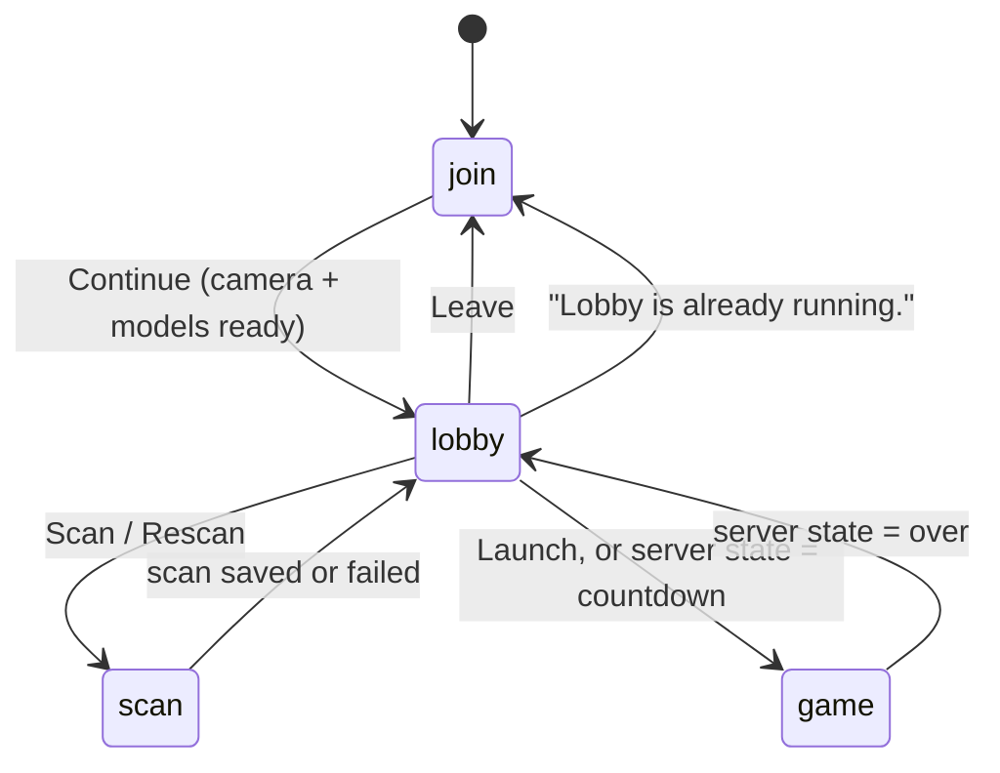

# App flow and screens

`public/app.js` is the client's entry point. It owns the screens, the camera, the render loop, scanning, shooting and the HUD, and wires together the other modules:

| Module | Used for |
| --- | --- |
| [`detector.js`](detection.md) | Creating the MediaPipe models and finding people in frames |
| [`identify.js`](identification.md) | Signatures, matching and the `Tracker` |
| [`transport.js`](networking.md) | The long-polling connection |
| [`sound.js`](feedback.md) | Sound effects |

`public/index.html` contains all four screens as sibling `<main>` elements; only one is visible at a time. A single `<video>` element and an overlay `<canvas>` are shared by the scan and game screens, so the camera is only requested once.

## Screens

`state.mode` tracks the current screen: `'join' | 'lobby' | 'scan' | 'game'`.

### Join (`#join-screen`)

- Pre-fills name and room from `localStorage`, or the room from a `?room=` URL parameter. The default room is `demo`.
- On **Continue**: unlocks audio, starts the rear camera (`facingMode: environment`, ideally 1280×720) and loads the detector models in parallel (`prepareCameraAndDetector`).
- Failures show a friendly message (`startupErrorMessage`): not HTTPS, permission denied, no camera, or the raw error.
- On success: switches to the lobby, requests a screen wake lock, starts the render loop and opens the connection.

### Lobby (`#lobby-screen`)

- Rendered by `renderLobby()` from the latest `state` and `roster` messages.
- One row per player with a **Scan/Rescan** button. Debug clones have no button and show *"Mirrors <name>'s scan"*.
- **Launch** (`launchGame`) first checks locally that everyone is scanned, then shows a local 5-second countdown, switches to the game screen, and sends `{type: 'start'}`. If the server rejects the start, the client returns to the lobby with the error.
- **Leave** (`leaveLobby`) tells the server immediately (`sendBeacon` to `/api/disconnect`), stops the camera and clears the saved lobby.

### Scan (`#scan-screen`)

`beginPlayerScan(player)` switches to this screen and starts `runAutoScan()` after the next paint. The full pipeline is described in [Scanning](scanning.md). While the scan screen is idle, the render loop draws every detected person, highlighting in green the one that would be captured.

### Game (`#game-screen`)

- `enterGame()` shows the camera, opens the SSE stream for the room and renders the HUD.
- Every frame, `loop()` runs detection when due, then `drawGame()` draws each live track with its hitboxes and label (see [Feedback](feedback.md#track-outlines)).
- **FIRE** (pointer down) or **Space** calls `fire()`. See [Shooting](#shooting).
- When a `state` message says `over`, every phone returns to the lobby showing *"You win!"* or *"<name> wins!"*.

## The render loop

`loop()` runs on every `requestAnimationFrame`:

1. If there's a new video frame and no scan is being post-processed:
   - **scan mode:** run `detectScanPeople` on the full frame;
   - **game mode:** call `refreshGameDetection()` if the detection interval has elapsed: 120 ms while acquiring people, 180 ms once every live track is identified.
2. `draw()` maps video coordinates to screen coordinates (the same maths as CSS `object-fit: cover`) and draws the overlay.
3. In game mode, update the countdown display.
4. In debug mode, update the debug overlay.

`refreshGameDetection()` downscales the frame to at most 512 px wide, detects people, scales the boxes back up, and passes them to `Tracker.update()` in closed-set mode (see [Identification](identification.md#4-closed-set-assignment)).

## Shooting

`fire()`:

1. Returns early unless the round is `playing`, the local player is alive, and 350 ms have passed since the last shot.
2. Plays the shot sound and button animation.
3. If the last detection is older than 90 ms, runs a fresh one (including the pose model when there are at least two candidates), so the shot uses an up-to-date frame.
4. Hit-tests the **centre of the video frame**, which is also the centre of the screen because the video is centred with `object-fit: cover`.
5. If a targetable player is under the crosshair, POSTs `/api/hit` with the target and zone.

A track is **targetable** (`isTargetableTrack`) only if all of these hold:

| Condition | Value |
| --- | --- |
| Track seen within | 520 ms (`LIVE_TRACK_MS`) |
| Identified as the same player for at least | 350 ms (`TARGET_LOCK_MS`) |
| Match score at least | 0.48 (`TARGET_MIN_SCORE`) |
| Upper, lower and grid similarity each at least | 0.22 (`TARGET_MIN_PART`) |
| Player is | alive, not yourself |

Head hitboxes are checked before body hitboxes across all tracks, so a headshot wins if boxes overlap.

The client does **not** change HP itself. It waits for the server's `hitConfirmed`, `gotHit` and `state` messages.

## Local storage

All keys are prefixed with `laser-tag:`. Reads and writes are wrapped in `try/catch`, so the game still works in private browsing.

| Key | Contents |
| --- | --- |
| `name`, `room` | Last-used name and room code |
| `activeLobby` | `{version: 1, name, room, playerId, debug}`. Used on page load to rejoin automatically as the same player. Cleared on Leave or rejection. |
| `scan:<room>:<name>` | Cached scan `{version, name, room, savedAt, gallery, thumbs}`. Your own cached scan is sent with your `join` message, so rejoining doesn't need a rescan. |

The scan cache is versioned (`SCAN_CACHE_VERSION`, currently 10). Bump it when the signature format changes so old caches are ignored.

## Wake lock

`keepScreenOn()` requests a screen wake lock when entering the lobby, scan or game, and again whenever the page becomes visible. If the browser doesn't support it, the game carries on.
