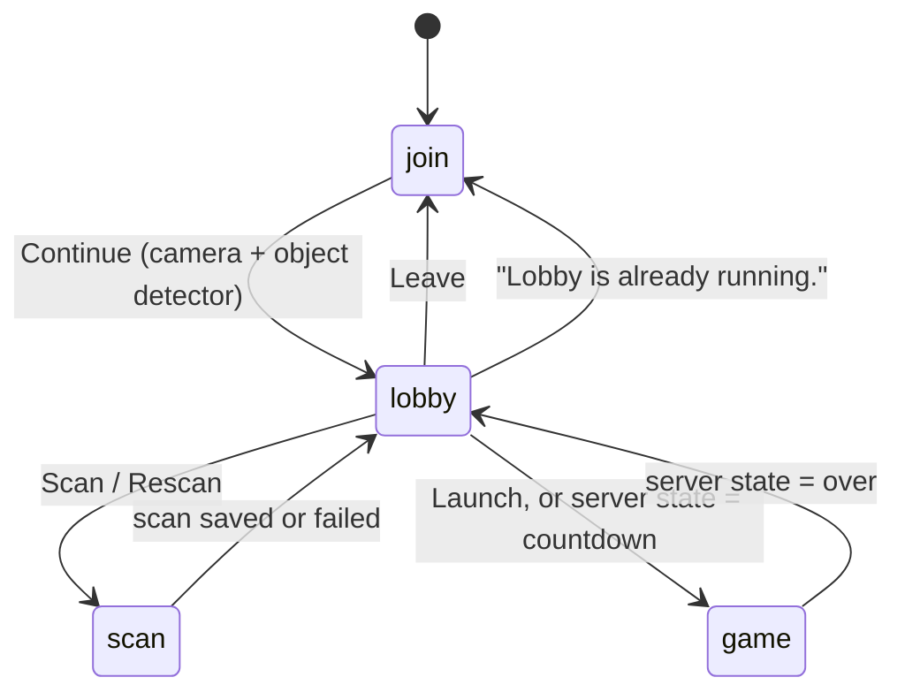

# App flow and screens

`frontend/public/app.js` is now just the entry point: it wires DOM events to the four screens and resumes an active lobby on load. Everything it used to own directly has moved into focused modules:

| Module | Used for |
| --- | --- |
| `env.js` | URL-parameter flags (`DEBUG`, `MOTION_ENABLED`, `REQUIRE_MOTION`, `MOTION_OFF`), `$()`, and the shared `video`/`canvas`/`ctx` |
| `state.js` | The one shared `state` object and the `localStorage` helpers |
| `roster.js` | Read-only lookups over the server's roster/game snapshot, plus `mergeRoster()` which folds in each roster delta |
| `camera.js` | Starting the camera and the on-device models, once, plus the first-inference warm-up |
| `startup.js` | What the player waits for on the way into the lobby, and what keeps loading behind them. No DOM and no imports, so the sequencing is testable on its own |
| `scan-reid.js` | The deferred OSNet pass at the end of a scan: which frames get embedded, and the averaging |
| `identity.js` | The one seam for "who is that person?": it installs a single identity provider at load and nothing else in the app knows which signals answer the question (see [Shooting](#who-counts-as-a-target) below) |
| `appearance-identity.js` | The provider installed by default: `isStableTarget()` and an appearance-only `resolve()` |
| `motion-identity.js` | The provider installed by `?motion=on`/`?motion=strict`: all phone-motion plumbing, sealed behind the provider it exports |
| `net.js` | Reconnect/resume and what each server message does to the screens, built on `transport.js`'s long-polling connection |
| `screens/join.js` | The join form and camera/model startup |
| `screens/lobby.js` | Lobby list, launch, leave |
| `screens/scan.js` | The rotation scan: recording, scoring, outlier/duplicate removal, the cache |
| `screens/game.js` | The frame loop, overlay, HUD/countdown and shooting |
| [`detector.js`](detection.md) | Creating the MediaPipe models and finding people in frames |
| [`identify.js`](identification.md) | Signatures, matching and the `Tracker` |
| [`reid.js`](identification.md#the-re-identification-embedding-reidjs) | The OSNet person re-identification embedding, the strongest identification signal when it loads |
| [`motion/sensor.js`](identification.md#what-each-phone-shares-motionsensorjs) | This phone's own accelerometer/gyroscope activity |
| [`motion/matching.js`](identification.md#motion-confirmation-motion) | Checking a tracked person's on-screen motion against each player's phone, and fusing that with the classifier |
| [`sound.js`](feedback.md) | Sound effects |

`frontend/public/index.html` contains all four screens as sibling `<main>` elements; only one is visible at a time. A single `<video>` element and an overlay `<canvas>` are shared by the scan and game screens, so the camera is only requested once.

## Screens

`state.mode` tracks the current screen: `'join' | 'lobby' | 'scan' | 'game'`.

### Join (`#join-screen`)

- Pre-fills name and room from `localStorage`, or the room from a `?room=` URL parameter. The default room is `demo`.
- On **Continue**: unlocks audio, calls `identity.start()` — a no-op unless `?motion=on` or `?motion=strict` installed the motion provider, and inside the tap because that's the only place iOS will show a sensor prompt — then opens the connection to the room and starts the camera and the models.
- Failures show a friendly message (`startupErrorMessage`): not HTTPS, permission denied, no camera, or the raw error. A camera failure also leaves the room again, rather than parking a player in everyone else's roster who can never be scanned or shot.
- On success: switches to the lobby, requests a screen wake lock and starts the render loop.

#### What Continue actually waits for

This is the part worth getting right, because it used to be the longest wait in the app. There are 18 MB of models and **only the object detector is required** — see the Required column in [Detection → The models](detection.md). The lobby itself needs none of them: `renderLobby()` reads the roster and draws a Scan button per player.

So `prepareCameraAndDetector()` resolves on **camera + object detector**, 7.25 MB, and not on the other 10.9 MB. [`startup.js`](../../frontend/public/startup.js) owns the sequencing:

| Started | Waits for | Lobby waits for it? |
| --- | --- | --- |
| Camera (`getUserMedia`) | — | **Yes** |
| WebAssembly fileset | — | **Yes** |
| Object detector, 7.25 MB | the fileset | **Yes** |
| Pose landmarker, 5.78 MB | the fileset *and* the object detector's delegate | No |
| MobileNet embedder, 4.12 MB | the same | No |
| [OSNet re-identification](identification.md#the-re-identification-embedding-reidjs), 891 KB | nothing — separate runtime | No |

Three things follow from that table:

- **Pose and the embedder are created in parallel with each other, not serially.** Both hang off one continuation on the object detector's answer. They have to wait for it because whether MediaPipe can use the GPU is only discovered by trying, and the object detector's attempt is what decides it for all three — a mixed GPU/CPU set is not a thing we want. Their *downloads* are deliberately not overlapped with it either: prefetching them into the HTTP cache cannot work, because `frontend/common-locations.conf` serves `.tflite` and `.task` with `Cache-Control: no-store`, so the browser may not reuse the response and the "prefetch" would just download 9.9 MB twice.
- **`connect()` happens before the wait, not after it.** Joining a room is network I/O with nothing to do with the models, and the roster it answers with is the only thing the lobby list is made of, so the lobby arrives populated instead of empty. `net.js` reads name, room, `resumePlayerId` and `localGallery` out of `state`, all set before the call.
- **The optional models land in `state` whenever they arrive**, and the delegate label is rebuilt each time, so the overlay's `+Pose`/`+Embed`/`+ReID` suffixes still report exactly what this phone got. A model that failed stays `null` — the game degrades to the next signal down rather than breaking.

Nothing is fire-and-forget, though, because code downstream reads these models. The one screen that genuinely needs them waits for the specific ones it uses: [enrolment](scanning.md#1-countdown) blocks before its countdown until the embedder and the recogniser have landed, because a scan without them silently enrols *weaker* signatures into a gallery that is then cached and matched against for the whole round. A 20 s cap (`SCAN_MODEL_WAIT_MS`) keeps a hung download from trapping the player there.

With `?debug`, the overlay gets a `Startup` line with each step's duration and the two totals — time to lobby-visible and time to all-models-ready. See [Debug mode](../development/debug-mode.md#startup-and-scan-costs).

- **Warm-up.** Loading a model and being able to *run* one are different things: MediaPipe compiles its WebGL shaders and ONNX Runtime builds its WASM kernels on a model's first inference, which costs far more than the ones after it. That cost used to land wherever the first real frame happened to fall — during the scan for a phone that scanned somebody, but during the *countdown* for a phone that was only ever scanned by others. So every freshly loaded model gets one throwaway inference (`warmUpModels`), on a 512px-wide canvas matching the gameplay inference path. It is deliberately **not** awaited: it runs two frames later, so the join screen never waits for it. A warm-up that fails is only logged — the models still work cold, which is where this started.

  Since the models no longer finish together, the warm-up is now **per model, as each one arrives**, rather than one batch at the end. That needed one subtlety spelling out. `warmUpStep` normally stands down once a screen that infers is up, because the warm-up's deliberately-low timestamp would be a step backwards for a model the scan or game loop has already fed a `performance.now()` value. A model created a moment ago is exempt (`fresh`): MediaPipe's monotonic-timestamp rule is **per task instance**, so a brand-new task has never been handed a timestamp by anyone — and "the first inference has been paid anyway" is simply untrue of a model that did not exist when those loops started. Without the exemption, a late embedder would pay its first inference in the middle of processing a rotation, which is the exact cost the warm-up exists to move.
- Refused motion access doesn't block anything when motion is enabled; `identity.start()` is retried on the first **FIRE** press, which also covers an automatic rejoin where there was no join tap.

### Lobby (`#lobby-screen`)

- Rendered by `renderLobby()` from the latest `state` and `roster` messages.
- One row per player with a **Scan/Rescan** button. Debug clones have no button and show *"Mirrors <name>'s scan"*.
- **Launch** (`launchGame`) first checks locally that everyone is scanned, then starts a local countdown of `GAME_LAUNCH_COUNTDOWN_MS` (3 s, mirroring the server's `COUNTDOWN_MS`), switches to the game screen, and sends `{type: 'start'}`. The local countdown is only a prediction so the first second isn't dead time: every `state` message with status `countdown` resets it to the server's own `startsInMs`. If the server rejects the start, the client returns to the lobby with the error.
- **Leave** (`leaveLobby`) tells the server immediately (`sendBeacon` to `/api/disconnect`), stops the camera and clears the saved lobby.

### Scan (`#scan-screen`)

`beginPlayerScan(player)` switches to this screen and starts `runAutoScan()` after the next paint. The full pipeline is described in [Scanning](scanning.md). While the scan screen is idle, the render loop draws every detected person, highlighting in green the one the scan would use.

A **✕** button in the corner calls `cancelScan()`, which just sets `state.autoScanning = false` and returns to the lobby with *"Scan cancelled."*. The recording, processing and countdown loops all check that flag every iteration and bail out cleanly, and their `finally` blocks notice the screen has changed and leave the UI alone.

### Game (`#game-screen`)

- `enterGame()` shows the camera, opens the SSE stream for the room and renders the HUD.
- Every frame, `loop()` runs detection when due, then `drawGame()` draws each live track with its hitboxes and label (see [Feedback](feedback.md#track-outlines)).
- **FIRE** (pointer down) or **Space** calls `fire()`. See [Shooting](#shooting).
- When a `state` message says `over`, every phone returns to the lobby showing *"You win!"* or *"<name> wins!"*.

## The render loop

`loop()` runs on every `requestAnimationFrame`:

1. If there's a new video frame and no scan is being post-processed:
   - **scan mode:** call `refreshScanPreview()`, which runs the cheap object-only pass on a 512-wide copy at most every 150 ms (`SCAN_PREVIEW_DETECT_INTERVAL_MS`) — and nothing at all while the rotation is being recorded (`state.recordingScan`). This is only the green highlight on the scan screen; the gallery is built afterwards from the recorded canvases. It used to run `detectScanPeople` — object detector *plus* pose landmarker — on the full-resolution video every single frame, which cost more than the entire processing pass that followed it;
   - **game mode:** call `refreshGameDetection()` if the detection interval has elapsed: 120 ms while acquiring people, 180 ms once every live track is identified, and never more often than the last detection's own time ÷ 0.7 (`DETECT_MAX_BUSY_SHARE`), so a phone that can't keep up stretches its own interval instead of spending more than ~70% of its time detecting.
2. `draw()` maps video coordinates to screen coordinates (the same maths as CSS `object-fit: cover`) and draws the overlay.
3. In game mode, update the countdown display.
4. In debug mode, update the debug overlay.

`refreshGameDetection()` downscales the frame to at most 512 px wide, detects people, scales the boxes back up, and passes them to `Tracker.update()` in closed-set mode along with the embedder and the re-identification handle (see [Identification](identification.md#5-closed-set-assignment)). It then hands the frame's tracks to `identity.observe()`, which does nothing by default; the motion provider uses it to keep each visible track's box, which is the history [motion matching](identification.md#motion-confirmation-motion) correlates against the other phones' accelerometer data. The loop never names the signal, so there is nothing to remove from it if motion goes away.

When enabled, motion itself runs on its own timers rather than in the loop: this phone's new samples are sent every 500 ms (`MOTION_SEND_INTERVAL_MS`), and a track's motion checks are recomputed at most every 300 ms (`MOTION_CHECK_MS`), lazily, the first time something asks for that track's identity.

## Shooting

`fire()`:

1. Returns early unless the round is `playing`, the local player is alive, and 350 ms have passed since the last shot.
2. Plays the shot sound and button animation.
3. If the last detection is older than 90 ms, runs a fresh one (including the pose model when there are at least two candidates), so the shot uses an up-to-date frame.
4. Hit-tests the **centre of the video frame**, which is also the centre of the screen because the video is centred with `object-fit: cover`.
5. If a targetable player is under the crosshair, POSTs `/api/hit` with the target and zone.

### Who counts as a target

`targetUnderCrosshair()` (in `screens/game.js`) walks the live tracks and asks `identity.resolve(track)` (the provider installed by `identity.js`) who each one is. By default that is `appearance-identity.js`, which applies the appearance-only gate below. With `?motion=on` or `?motion=strict` it is `motion-identity.js`, which takes the tracker's appearance answer and runs it through [`fuseMotion()`](identification.md#fusing-it-with-the-classifier-fusemotion) with the motion checks for that track. A track is shootable when `identity.resolve()` returns a `playerId` the server says is alive.

A track must be seen within 520 ms (`LIVE_TRACK_MS`) to be considered at all. Beyond that, the usual route is classifier-only; motion-confirmed identities are available only when motion is enabled:

| Route | Requirements |
| --- | --- |
| **Motion-confirmed** | Only with `?motion=on` or `?motion=strict`: the target's own phone reports motion that correlates with the person on screen (or, where appearance said nothing, exactly one phone does). No score minimum — the confirmation is the evidence. |
| **Classifier-only** | No usable motion data, and the appearance identity is "confident on its own": `isStableTarget()` below. Unavailable with `?motion=strict`. |

With motion enabled, a motion-confirmed identity is targetable immediately, with no lock-time requirement - only liveness (`LIVE_TRACK_MS`) applies. `isStableTarget(track)` (in `appearance-identity.js`, alongside the `TARGET_*` constants) requires the identity to have been held for at least 150 ms when re-identification decided (`TARGET_LOCK_REID_MS`) or 350 ms on the colour signature (`TARGET_LOCK_MS`), plus a score floor that depends on which signal decided:

| | Score floor | Per-part floors |
| --- | --- | --- |
| Re-identification embedding decided (`track.hasReid`) | the accept threshold itself (`reidTargetMinScore()`, in `identify.js`), so `?reid=` moves the shot gate with it | none — the embedding has already cleared its own threshold, and lighting can push the colour parts down for the right person |
| Colour signature decided | 0.48 (`TARGET_MIN_SCORE`) | upper, lower and grid each ≥ 0.22 (`TARGET_MIN_PART`) |

When enabled, motion can also actively *remove* a target: if the appearance classifier names a player but that player's phone clearly isn't moving with the person on screen, the identity is vetoed and the track draws as an unnamed "Person" (in debug mode, *"not Name (motion)"*). If exactly one other ranked candidate's phone does match, the identity is corrected to them instead.

Head hitboxes are checked before body hitboxes across all tracks, so a headshot wins if boxes overlap.

The client does **not** change HP itself. It waits for the server's `hitConfirmed`, `gotHit` and `state` messages.

## Local storage

All keys are prefixed with `laser-tag:`. Reads and writes are wrapped in `try/catch`, so the game still works in private browsing.

| Key | Contents |
| --- | --- |
| `name`, `room` | Last-used name and room code |
| `activeLobby` | `{version: 1, name, room, playerId, debug}`. Used on page load to rejoin automatically as the same player. Cleared on Leave or rejection. |
| `scan:<room>:<name>` | Cached scan `{version, name, room, savedAt, gallery, thumbs}`. Your own cached scan is sent with your `join` message, so rejoining doesn't need a rescan. |

The scan cache is versioned (`SCAN_CACHE_VERSION`, currently **12** — version 12 stores `shape` raw rather than L2-normalised; version 11 was the one whose samples carry a re-identification embedding). Bump it when the signature format changes so old caches are ignored.

## Wake lock

`keepScreenOn()` requests a screen wake lock when entering the lobby, scan or game, and again whenever the page becomes visible. If the browser doesn't support it, the game carries on.
