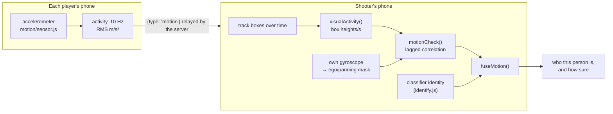

# Player identification

Detection only says "there's a person here". With more than two players, a phone also needs to know *who* that is, to credit the right hit. The client answers that with four pieces:

1. **Signatures**: a compact description of how a person looks in one frame (`identify.js`, plus the re-identification embedding from `reid.js`).
2. **Gallery matching**: compare a signature against every player's scanned gallery (`identify.js`).
3. **The tracker**: follow people across frames so identity is stable and matching doesn't run on every frame (`identify.js`).
4. **Motion confirmation**: check the person's on-screen movement against what each player's own phone reports, and confirm or veto the answer (`motion/matching.js`, `motion/sensor.js`).

Everything runs on the phone. Players' galleries come from the server's `roster` message; their motion comes from the server's `motion` relay.

## The signals, in order of strength

Appearance matching uses whichever of these it has, strongest first:

| Signal | Where | Used when | Measured strength |
| --- | --- | --- | --- |
| **Re-identification embedding** (`reid`) | OSNet x0.25 in `reid.js` | Both the live signature and the gallery sample have one. It then **decides alone**: the colour parts are computed but not mixed in. | ~77% of players recognised at a 5% bystander-acceptance rate (Market-1501, 2–4 enrolled players + 20 bystanders) |
| **Colour + MobileNet embedding** | `identify.js` + the embedder from `detector.js` | No `reid` on one side, but both sides have `embed`. The score is a weighted blend of the colour parts and the embedding. | ~34% at the same false-accept rate, for the whole colour + embedding signature |
| **Colour only** | `identify.js` | Neither model loaded. The baseline: upper/lower histograms, grid and shape. | weakest |

If enabled with `?motion=on` or `?motion=strict`, **motion is an independent layer** on top of whichever of those produced an answer: it can confirm the answer, correct it to another candidate, veto it, or name a person the appearance signals left unknown. It never contributes to the appearance score itself.

Both models are optional. `createReid()` failures are caught in `camera.js` (the delegate label simply loses its `+ReID` suffix), and the embedder is optional in `createDetector()`, so the game degrades to the next row down rather than breaking. A phone where OSNet failed to load still scans and still plays — its galleries just carry no `reid`, and matching falls to the second row.

## Signatures

`extractSignature(source, box, embedder, timestamp)` returns:

| Field | Length | What it captures | Region of the person box |
| --- | --- | --- | --- |
| `hist` | 64 | Upper-body colour: 12 hues × 4 saturations (48), plus 8 brightness and 8 saturation bins so grey/black/white clothes still count | x 16–84%, y 20–62% |
| `lower` | 64 | Same descriptor for the lower body. A strong guard: a similar shirt isn't enough if the trousers differ. | x 18–82%, y 58–92% |
| `grid` | 192 | 6×8 grid of brightness, saturation and hue (as sin/cos weighted by saturation). A rough colour+shape fingerprint that *does* change with viewing angle. | x 8–92%, y 6–94% |
| `shape` | 2 | Box aspect ratio, and the ratio of its height to its width as fractions of the frame | whole box |
| `embed` | 256 | Optional MobileNetV3 embedding, compacted from the model's output and rounded to 4 decimals so galleries stay small | box with a little padding |
| `usable` | bool | Whether the box is big and whole enough to trust (not sent to the server) | |

A sixth field, `reid` (512 floats), is **not** produced by `extractSignature`. Because inference is asynchronous it is attached by the caller afterwards — and the two callers do it very differently:

- **Scanning** awaits it (`await reid.embed(...)`), but only for the frames behind a gallery sample that survived selection, *after* selection has run. Selection itself never looks at `reid`. See [Scanning → Deferred work](scanning.md#5-deferred-work-and-what-it-saves).
- **The tracker** never awaits it. It takes whatever `reid.latest(track)` already holds and asks for a fresh one for next time.

Colour features are computed by drawing the region onto a tiny canvas (18×24 for histograms, 6×8 for the grid) and reading the pixels, which is cheap. All vectors are L2-normalised.

`averageSignatures()` averages a list of signatures field by field (including `reid`, re-normalised); scanning uses it to smooth samples. Because scanning now attaches `reid` *after* averaging, `scan.js` re-does that one field with the same arithmetic (`averageReidVectors`), so an averaged sample still ends up with the mean of its frames' embeddings.

## The re-identification embedding (`reid.js`)

`reid.js` wraps **OSNet x0.25** (Zhou et al., *Omni-Scale Feature Learning for Person Re-Identification*), trained on MSMT17 by the Torchreid authors — MIT licence — and exported to ONNX as `frontend/public/models/osnet_x0_25_msmt17.onnx` (0.9 MB). Unlike the colour features and the generic MobileNet embedding, it was trained for exactly this job: deciding whether two crops of a person are the same person, across cameras, angles and lighting.

It runs in **ONNX Runtime Web** on WebAssembly, served from `node_modules/onnxruntime-web/dist/` at `/vendor/ort/` by nginx — not through MediaPipe. Threading needs cross-origin isolation, which the game doesn't have, so it runs single-threaded unless `crossOriginIsolated` is true; the model is small enough that this is fine.

### Pre-processing

Each person box is cropped and resized to the model's **128×256** input, converted to ImageNet-normalised CHW floats (mean `0.485, 0.456, 0.406`, std `0.229, 0.224, 0.225`). The output is a 512-dimensional vector, L2-normalised and rounded to 4 decimals so a 24-sample gallery still fits comfortably in a `join` or `scan` message.

### The asynchronous API

Inference can't be done inline in the render loop, so the module is request/collect:

```js
const reid = await createReid();
reid.request(track, video, track.box); // snapshot the crop now, embed in the background
reid.latest(track, maxAgeMs);          // most recent embedding for that key, or null (default 800 ms)
await reid.embed(source, box);         // one-off, awaited; used while scanning
```

- `request()` grabs the pixels immediately and queues the inference. One inference runs at a time; a second request for the same key while one is pending is dropped rather than queued, so the model never falls behind the camera.
- Results are stored in a `WeakMap` keyed by the object you pass (the tracker passes the track), so entries disappear with the track.
- `latest()` returns `null` for an embedding older than `maxAgeMs` (800 ms by default), which is what makes the tracker fall back to "not yet identifiable" rather than matching against a stale crop.

### How much of it runs, and where

The model is the most expensive inference in the app, so both callers limit how often it runs — in opposite ways:

| | Scanning | Gameplay |
| --- | --- | --- |
| Call | `embed()`, **awaited** | `request()` / `latest()`, never awaited |
| How often | Once per frame backing a chosen gallery sample — roughly **30 inferences per scan**, after selection has picked the samples | At most one in flight at a time; requested on each due identity check per track (its first 6 checks, then every 250 ms) |
| If it isn't ready | Not applicable — the scan waits | The check is **skipped** and the track stays unnamed |
| If it fails | The whole scan fails with *"Could not process the rotation video"* | Logged and ignored; the track simply has no recent embedding |

[Detection → Which model runs when](detection.md#which-model-runs-when) has the same comparison for all four on-device models.

### Why it overrides rather than blends

When both sides of a comparison have a `reid` vector, `similarityParts()` sets the match score to the cosine similarity of the two embeddings alone. Blending the colour parts in was measured to make it *worse*, so the colour similarities are still computed but only reported (for the debug overlay) and not weighted into the score. `hasReid` on a match result says which mode produced it.

## Comparing a signature to one player

`bestAngleScore(signature, gallery)` compares the signature with every sample in the player's gallery. For each sample it computes cosine similarities for `hist` (*upper*), `lower`, `grid`, `embed` and `reid`, and a log-ratio similarity for `shape`. How those become one score depends on what's available:

| Available on both sides | Score |
| --- | --- |
| `reid` | the `reid` cosine similarity, on its own |
| `embed` (but no `reid`) | 0.30 upper + 0.18 lower + 0.16 grid + 0.06 shape + 0.30 embed |
| neither | 0.42 upper + 0.24 lower + 0.24 grid + 0.10 shape |

The best-matching sample wins: this is what makes matching work from any side, since the gallery holds front, side and back views. To avoid trusting a single lucky sample, the final score blends in the other samples that score within 0.1 of the best (up to 3 in total): 75% best + 25% their average, plus 0.012 per supporting sample.

## Matching against the room

`matchGallery(signature, players, excludeId, options)` scores every player, ranks them, and records each one's margin over its closest rival. The acceptance rules differ per mode.

### With a re-identification embedding

Only two checks apply, because the score is a single well-calibrated similarity:

| Check | Threshold | Rejection reason |
| --- | --- | --- |
| Overall score | ≥ 0.72 (`REID_MATCH_THRESHOLD`) | `score` |
| Lead over runner-up | ≥ 0.03 (`REID_MATCH_MARGIN`) | `margin` |

The threshold was chosen on Market-1501 in simulated 2–4 player games, per single check:

| Threshold | Players recognised | Bystanders accepted | Wrong player |
| --- | --- | --- | --- |
| 0.70 | 87% | 10.8% | 0.3–0.5% |
| 0.72 | 83% | 7.6% | 0.3–0.5% |
| 0.74 | 77% | 4.9% | 0.3–0.5% |
| 0.76 | 71% | 3.1% | 0.3–0.5% |

Those are per-check numbers; the tracker needs several agreeing checks before it names a track, so the per-person bystander rate is lower again. The margin check is what halves wrong-player assignments.

### Without one (colour, with or without `embed`)

In **open-set** mode the best player is accepted only if all of these hold. Otherwise the person stays unknown:

| Check | Threshold | Rejection reason |
| --- | --- | --- |
| Overall score | ≥ 0.54 | `score` |
| Upper-body similarity | ≥ 0.50 | `upper` |
| Lower-body similarity | ≥ 0.38 | `lower` |
| Grid similarity | ≥ 0.40 | `grid` |
| Shape similarity | ≥ 0.36 | `shape` |
| Lead over runner-up | ≥ 0.06 | `margin` |

If the best match is the local player (`excludeId`), the result is rejected with reason `self`.

### Closed-set mode

The game runs matching in **closed-set** mode: the local player is included as a candidate (for the self-match guard) and the ranking is returned even when nothing clears the bar. What happens to a sub-threshold best match differs by signal:

- **Colour only:** closed set assumes everyone visible is one of the room's players and accepts the best match anyway. That's survivable for weak colour features, but it's exactly what used to label bystanders as players.
- **With `reid`:** the thresholds are kept (`accepted` is only true when nothing was rejected), because the scores are reliable enough to say "none of them". A bystander in frame stays "Person".

The "is this good enough to shoot?" decision still belongs to the [targeting rules](app-flow.md#shooting).

### The self-match guard

The game adds the local player's own gallery to the candidate list under the label "Person". If a body looks most like *you* (a reflection, or your own webcam in debug mode), it's claimed by "self", the track is marked `selfRejected` and it can't be credited to someone else.

## The tracker

`Tracker.update(boxes, video, players, selfId, now, options)` is called after each detection. It returns the list of tracks, each with a box, a velocity and an identity (`playerId`, `name`, `score`, the per-part similarities, and `hasReid`/`reid` when the re-identification model decided).

`options` are `{ includeRejected, embedder, reid, identifyOnce, closedSet }`. The game passes the embedder, the `reid` handle, `closedSet: true`, and `includeRejected` only in debug mode.

### 1. Associating boxes with tracks

Each existing track predicts where it is now from its velocity. Every (track, box) pair is scored as 0.5 × IoU + 0.35 × centre closeness + 0.15 × size similarity. Pairs scoring at least 0.3 are matched greedily, best first. A matched track's box is smoothed toward the new box (68% new), and its velocity updated.

Unmatched boxes start new tracks. Tracks not seen for 900 ms are dropped.

### 2. Deciding when to re-identify

Matching only runs on a track that was seen this frame and:

- has no identity yet, **or**
- is in its first 6 checks (to identify new people fast), **or**
- hasn't been checked for 250 ms.

Between checks, identity simply rides along with the track.

### 3. Waiting for a re-identification embedding

When a `reid` handle is passed, each due check:

1. takes the track's most recent embedding (`reid.latest(track)`);
2. asks for a fresh one for the next check (`reid.request(track, video, track.box)`);
3. **skips the check entirely if there is no recent embedding.**

That last step matters: while the model is still warming up on a new track, the track is left unidentified rather than being named from colours alone. Identifying from colours in closed-set mode is what used to put a player's name on a bystander.

### 4. Evidence and hysteresis

Each check adds **evidence** for the matched player, and old evidence decays (×0.82 per check). Accepted matches add 1.25; plausible-but-rejected ones add `0.45 +` however far the score is above the evidence floor; weak ones add nothing. A player becomes the evidence winner once they have at least 0.58 and lead the next player by 0.12.

The floors for "plausible" depend on the signal:

| | Minimum score to count as evidence | Minimum score for a soft label |
| --- | --- | --- |
| With `reid` | 0.62 (`REID_EVIDENCE_MIN_SCORE`) | 0.66 (`REID_SOFT_LABEL_SCORE`) |
| Colour | 0.42 (`EVIDENCE_MIN_SCORE`), and each part ≥ 0.24 | 0.48 (`SOFT_LABEL_SCORE`), and each part ≥ 0.24 |

A *soft label* is a rejected match that is still good enough to be the track's candidate for the hysteresis below. Matches rejected for `margin` are never soft-labelled: an ambiguous frame should not nudge the identity either way.

The identity then changes only through hysteresis:

| Situation | Needed to (re)assign |
| --- | --- |
| New track, very confident match (score ≥ 0.80 with `reid`, ≥ 0.66 without) | 1 check |
| New track, otherwise | 2 agreeing checks in a row |
| Track already identified as someone else | 4 agreeing checks in a row |
| Check finds no candidate | Identity is **kept**. A known track only loses its identity when it disappears, loses a conflict, or another player wins the switch. |

This stops a single blurry or side-on frame from flipping who you'd be credited with shooting.

### 5. Closed-set assignment

In closed-set mode with two or more visible tracks, `resolveClosedSetIdentities()` solves the assignment for all visible tracks together: it ranks every (track, player) pair by score, with small bonuses for margin, keeping the current identity, accumulated evidence and supporting angles, and assigns greedily so each player gets at most one track. Visible tracks left without a player become unknown.

### 6. Duplicate resolution

Finally, if two tracks still carry the same player, the one seen this frame (then the higher-scoring one) keeps it and the others are cleared.

## Motion confirmation (`motion/`)

Motion tracking is disabled by default. The code below is used only when the page is opened with `?motion=on` or `?motion=strict`.

Appearance alone can't tell apart two people in similar clothes, and it can put a player's name on a bystander who happens to look like them. Motion matching adds a signal that has nothing to do with appearance: **every phone knows how much it is being moved, and the camera can see how much each person on screen is moving.** They should rise and fall together for the right pairing, and be unrelated for a wrong one.



### What each phone shares (`motion/sensor.js`)

`MotionSensor` listens to `devicemotion` and condenses it into one number per 100 ms bin:

- **activity**: the RMS of linear acceleration (gravity removed) over the bin, in m/s². Walking or dodging shows up clearly; holding the phone still to aim barely does. If the device gives no gravity-free `acceleration`, gravity is removed with a slow low-pass filter over `accelerationIncludingGravity`.
- **ego**: `1` if the phone's rotation rate exceeded 10 °/s anywhere in the bin, else `0`. This is the *shooter's* own panning flag — while you swing the camera to follow someone, image motion says nothing about how they are moving, so those bins are masked out of the correlation.

Timestamps are `Date.now()` so they line up across phones. 12 seconds of history is kept.

`MotionSensor.requestPermission()` must run inside a user gesture on iOS; when motion is enabled, the client calls it from the join-form submit handler and again on the first FIRE press, in case the player arrived by automatic rejoin. If permission is refused, nothing breaks: motion checks simply all return `unknown` and appearance decides on its own.

`takeOutgoing()` returns the bins recorded since the last call; when enabled, `motion-identity.js` flushes them to the server every 500 ms as `{type: 'motion', s: [[t, v], ...]}`, and the server relays each phone's samples to everyone else in the room.

### The person on screen

`visualActivity(observations)` turns a track's box history (`[{t, box}]`, recorded every detection) into the same kind of series: how fast the box centre moves, **in box heights per second**. Dividing by box height makes it independent of how far away the person is, so it's comparable with an accelerometer magnitude.

### The check (`motionCheck`)

`motionCheck({visual, remote, ego, now, ...options})` resamples both series onto a 100 ms grid over the last 6 seconds, then searches clock offsets from −400 ms to +400 ms for the best Pearson correlation, skipping bins where either series has no data or the shooter was panning.

| Outcome | When |
| --- | --- |
| `consistent` | correlation ≥ 0.75 |
| `inconsistent` | correlation ≤ 0.30 |
| `unknown` | in between, or not enough usable bins (< 60% of the window), or the person barely moved (visual spread < 0.08 box heights/s), or the phone barely moved (remote spread < 0.25 m/s²) |

The 6-second window and the 0.75 threshold come from simulation (random walk/stand patterns with detector jitter): the real player matched every time and a bystander in about 1% of cases, while 4-second windows let 10–20% of bystanders match by coincidence. About 60% of bystanders land in `inconsistent`, and no players did.

`motion/matching.js` is deliberately free of browser APIs, so all of this is unit-tested in Node (`test/motion.test.js`).

### Fusing it with the classifier (`fuseMotion`)

`fuseMotion({classifier, opponents, checks, requireMotion})` combines the appearance answer with one `motionCheck` per living opponent:

| Classifier says | Motion says | Result | `source` / `reason` |
| --- | --- | --- | --- |
| player P | P's phone moves with them | **P** | `both` / `confirmed` |
| player P | no usable data | **P**, if the classifier is confident on its own | `classifier` / `classifier-only` |
| player P | no usable data, classifier not confident | nobody | `unconfirmed` |
| player P | P's phone clearly doesn't match, and exactly one other candidate's does | **that other player** | `both` / `corrected` |
| player P | P's phone clearly doesn't match, no single alternative | nobody | `vetoed` |
| nobody | exactly one player's phone matches | **that player** | `motion` / `motion-only` |
| nobody | several or no phones match | nobody | `ambiguous` / `unrecognised` |
| self-match | — | nobody | `self` |

"Confident on its own" is `isStableTarget()` in `motion-identity.js` — the same lock time and score minimums the [targeting rules](app-flow.md#shooting) use. With no motion data at all (nobody granted permission, or everyone is standing still), the `classifier-only`/`unconfirmed` rows apply and behaviour matches the pre-motion behaviour - but note that's *not* true of the `corrected`/`vetoed` rows: if motion data exists and disagrees with a correct, confident classifier answer (which real sensor noise - clock drift, a pocketed phone, a throttled background tab - can cause, independent of whether the shooter personally granted motion permission, since other players' shared samples are what gets checked), the shot can be silently discarded or retargeted even though the pre-motion logic alone would have gotten it right.

With `?motion=strict` in the URL, `requireMotion` is set and the `classifier-only` fallback is removed: a shot then only counts when the target's own phone confirms who they are. Without `?motion=on` or `?motion=strict`, motion is off and `resolveIdentity()` skips `fuseMotion()` entirely, falling back unconditionally to the appearance gate (`isStableTarget()` alone).

### How the client drives it

When motion is enabled, `motion-identity.js` keeps `state.remoteMotion` (player id → activity series) and `state.trackMotion` (a `WeakMap` from track to box observations), both trimmed to 12 seconds. `resolveIdentity(track)` re-runs the checks for a track at most every 300 ms and caches the result on the track, so the fused identity is cheap to ask for from both the draw loop and the hit test. Drawing shows a confirmed identity as *"Name (moves)"*, and in debug mode a vetoed one as *"not Name (motion)"*.

## Swapping in a better model

`extractSignature()` and `matchGallery()` are the only boundary the rest of the code depends on. `reid` was added exactly this way — as another signature field, without touching the tracker, scanning or game code — and a future model can be too. Remember to:

- add the field to `GALLERY_FIELDS` in `backend/sanitize.py` (see [Protocol → Gallery format](../server/protocol.md#gallery-format));
- decide how it combines with the existing score in `similarityParts()` (`reid` overrides rather than blends, because blending measured worse);
- give it its own thresholds if its scores aren't on the same scale as the colour score — `rejectionReason()`, `evidenceWeight()` and `softLabelMatch()` all branch on `hasReid` for this reason;
- bump `SCAN_CACHE_VERSION` in `screens/scan.js` so stale cached scans are ignored (see [Scanning → Why the version exists](scanning.md#why-the-version-exists));
- check whether [sample selection](scanning.md#4-sample-selection) should use it. `signatureSimilarity()` in `scan.js` deliberately uses the colour fields only, which is both why a view-invariant field like `reid` must stay out of it and why such a field can be computed after selection instead of during it;
- check the [gallery size](../server/protocol.md#gallery-format) still fits under `MAX_BODY_BYTES`.

## Tuning

All thresholds and weights are module constants in `identify.js`, `reid.js` and `motion/`. See [Configuration → Identification](../development/configuration.md#identification) and [Configuration → Motion](../development/configuration.md#motion). Use [debug mode](../development/debug-mode.md) to see live scores, rejection reasons and motion correlations while tuning.
