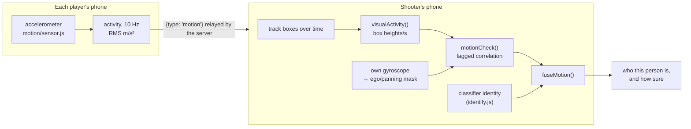

# Player identification

Detection only says "there's a person here". With more than two players, a phone also needs to know *who* that is, to credit the right hit. The client answers that with four pieces:

1. **Signatures**: a compact description of how a person looks in one frame (`identify.js`, plus the re-identification embedding from `reid.js`).
2. **Gallery matching**: compare a signature against every player's scanned gallery (`identify.js`).
3. **The tracker**: follow people across frames so identity is stable and matching doesn't run on every frame (`identify.js`).
4. **Motion confirmation**: check the person's on-screen movement against what each player's own phone reports, and confirm or veto the answer (`motion/matching.js`, `motion/sensor.js`).

Everything runs on the phone. Players' galleries come from the server's `roster` message — every phone holds everyone's signatures, which is why the roster is sent as a [delta](../server/protocol.md#the-roster-delta) rather than trimmed: each gallery still reaches each phone, just only once. Their motion comes from the server's `motion` relay.

## The signals, in order of strength

Appearance matching uses whichever of these it has, strongest first:

| Signal | Where | Used when | Measured strength |
| --- | --- | --- | --- |
| **Re-identification embedding** (`reid`) | OSNet x0.25 in `reid.js` | Both the live signature and the gallery sample have one. It then **decides alone**: the colour parts are computed but not mixed in. | ~77% of players recognised at a 5% bystander-acceptance rate (Market-1501, 2–4 enrolled players + 20 bystanders) |
| **Colour + MobileNet embedding** | `identify.js` + the embedder from `detector.js` | No `reid` on one side, but both sides have `embed`. The score is a weighted blend of the colour parts and the embedding. | ~34% at the same false-accept rate, for the whole colour + embedding signature |
| **Colour only** | `identify.js` | Neither model loaded. The baseline: upper/lower histograms, grid and shape. | weakest |

Unless disabled with `?motion=off`, **motion is an independent layer** on top of whichever of those produced an answer: it can confirm the answer, correct it to another candidate, veto it, or name a person the appearance signals left unknown. It isn't part of the per-check appearance score, but it nudges a track's typical score for a player: +0.06 when that player's phone moves with the person on screen, −0.08 when it clearly doesn't (`motionScoreAdjustment()` in `motion-identity.js`). Real games put players at 0.70–0.80+ and non-players at 0.60–0.65, so this widens the gap whenever people move.

Both models are optional. `createReid()` failures and `createEmbedder()` failures are both caught in [`startup.js`](app-flow.md#what-continue-actually-waits-for), which lands `null` in the corresponding `state` slot (the delegate label simply loses its `+ReID` or `+Embed` suffix), so the game degrades to the next row down rather than breaking. A phone where OSNet failed to load still scans and still plays — its galleries just carry no `reid`, and matching falls to the second row.

Being optional is why neither is on the critical path into the lobby. It is also why [enrolment](scanning.md#0-waiting-for-the-models-if-it-comes-to-that) waits for both before it starts: *failing* to load is graceful degradation the player can see and live with, whereas enrolling a gallery while they were still *loading* is silent degradation baked into a cached gallery for the whole round.

## Signatures

`extractSignature(source, box, embedder, timestamp)` returns:

| Field | Length | What it captures | Region of the person box |
| --- | --- | --- | --- |
| `hist` | 64 | Upper-body colour: 12 hues × 4 saturations (48), plus 8 brightness and 8 saturation bins so grey/black/white clothes still count | x 16–84%, y 20–62% |
| `lower` | 64 | Same descriptor for the lower body. A strong guard: a similar shirt isn't enough if the trousers differ. | x 18–82%, y 58–92% |
| `grid` | 192 | 6×8 grid of brightness, saturation and hue (as sin/cos weighted by saturation). A rough colour+shape fingerprint that *does* change with viewing angle. | x 8–92%, y 6–94% |
| `shape` | 2 | Box aspect ratio, and the ratio of its height to its width as fractions of the frame. The only field kept on its **raw** scale rather than L2-normalised — see below | whole box |
| `embed` | 256 | Optional MobileNetV3 embedding, compacted from the model's output and rounded to 4 decimals so galleries stay small | box with a little padding |
| `usable` | bool | Whether the box passed `boxQuality()` outright — big and whole enough to trust (not sent to the server) | |
| `range` | string | If it didn't, why: `far-reid`, `below-floor`, `partial-body` or `edge-clipped`. See [Box range](#box-range-and-the-far-band) | |
| `rangePenalty` | number | How much extra a re-identification score must clear for this box. `0` for anything `usable` | |

A sixth field, `reid` (512 floats), is **not** produced by `extractSignature`. Because inference is asynchronous it is attached by the caller afterwards — and the two callers do it very differently:

- **Scanning** awaits it (`await reid.embed(...)`), but only for the frames behind a gallery sample that survived selection, *after* selection has run. Selection itself never looks at `reid`. See [Scanning → Deferred work](scanning.md#5-deferred-work-and-what-it-saves).
- **The tracker** never awaits it. It takes whatever `reid.latest(track)` already holds and asks for a fresh one for next time.

Colour features are computed by drawing the region onto a tiny canvas (18×24 for histograms, 6×8 for the grid) and reading the pixels, which is cheap.

**`shape` is the one exception to normalisation.** `hist`, `lower`, `grid`, `embed` and `reid` are all L2-normalised, on both the live and the gallery side (`averageVectors`), which costs nothing because they are compared with cosine similarity — it divides by the magnitudes anyway. `shape` is compared as a **log ratio of aspects**, which is scale-*sensitive*, so it is averaged raw (`meanVector`) and an enrolled `shape[0]` is a genuine aspect ratio you can read. Normalising it, as the code used to, divided each aspect by its own vector's magnitude; since the second component is just the aspect times the frame's aspect ratio, that cancelled the aspect out entirely and every enrolled person ended up with the same value — 0.600 in a 4:3 frame — so the correct person scored 0. Fixed; the whole story is in [the bug report](../shape-feature-bug.md), and the gallery format change is why `SCAN_CACHE_VERSION` is 12.

`averageSignatures()` averages a list of signatures field by field (including `reid`, re-normalised); scanning uses it to smooth samples. Because scanning attaches `reid` *after* averaging, `scan-reid.js` re-does that one field with the same arithmetic (`averageReidVectors`), so an averaged sample still ends up with the mean of its frames' embeddings.

## Box range and the far band

`boxQuality()` decides whether a detector box is worth a signature at all, and the answer is the
advice shown during enrolment ("step a little closer"), checked in that order: too small
(`too-far`), a bad aspect ratio (`partial-body`), then touching the frame edge while still small
(`edge-clipped`).

For live matching the size limit is `MIN_MATCH_HEIGHT_RATIO`, **0.18 of frame height**. At 720p
that is 130 px, which is a 1.7 m person at roughly 10–12 m through a ~45° vertical field of view.
It used to be an outright refusal: `usable: false`, and `bestAngleScore()` returned `null`, so a
player past that distance was never identified **at any score**.

That limit is real for the colour features and for the MobileNet blend, which read a crop that at
this size is mostly interpolation. It is *not* real for re-identification, the one signal trained
across scales and viewpoints. So below 0.18 a box falls into a **far band** where
re-identification alone may still try it:

| `range` | When | What may score it |
| --- | --- | --- |
| `ok` | passed `boxQuality()` | everything, unchanged — `rangePenalty` is `0` and the field is absent from the match |
| `far-reid` | under 0.18 but above the far floor | `reid` only, and only above a **stricter** score |
| `below-floor` | under `FAR_REID_MIN_HEIGHT_RATIO` (0.09) or `FAR_REID_MIN_WIDTH_RATIO` (0.025), or tall but too narrow | nothing, and no OSNet inference is spent on it either |
| `partial-body` / `edge-clipped` | `boxQuality()`'s two non-distance refusals | nothing. Unchanged by the band |

Both far floors are read off OSNet's own input size (128 × 256 in `reid.js`) at the point where the
crop is **4× upscaled** — a quarter of the linear detail, a sixteenth of the pixels the model
expects, which is where a standing person's distinguishing bands drop under about 8 px and a pixel
of box jitter moves them by more than one band. Which floor binds depends on how slim the box is:
for a standing person (aspect ~2.5 in a 16:9 frame) it is the width one, reached at about 0.111 of
frame height, so the band buys roughly 1.6× the range — 10–12 m becomes 16–19 m. The height floor
binds only for squatter boxes, where it reaches 0.09.

A band box is charged a **penalty on the score it has to clear**, not a discount: a small crop is
less trustworthy, so it must beat a higher bar. The penalty is the normalised shortfall below 0.18,
squared — 0 at the line, rising to `FAR_REID_MAX_PENALTY` (0.11) at the floor, which puts the
floor's requirement at 0.65 + 0.11 = **0.76**, the strictest row in [the measured
table](#with-a-re-identification-embedding) below. Squared rather than linear so there is no step
at 0.18: a detector box jittering across the line behaves the same on both sides.

Two consequences are worth stating plainly, because they are what makes the band safe:

- **At or above 0.18, behaviour is unchanged.** The penalty is 0 and `rangePenalty` is absent from
  the match object entirely. `npm run eval:shape` is byte-identical over its 2880 sightings.
- **A band box that can't clear its bar produces no ranking at all** — not a rejected one. That is
  byte for byte what it produced before, so evidence accumulation, soft labels, the closed-set
  assignment and a latched name all carry on behaving exactly as they did.

`Tracker.update()` also stops asking `reid.js` for an embedding on a `below-floor` box. It used to
request one before matching and the result was discarded at the `usable` gate, so every too-small
box in frame bought a full 128 × 256 inference on every check.

`rangeDiagnostics()` returns counts of why live boxes were refused since the last
`resetRangeDiagnostics()` — `{ ok, tooFar, farReid, belowFloor, partialBody, edgeClipped }`, one
increment per check. `farReid` is a box the band got through; `tooFar` is one it refused, for want
of an embedding or for failing the stricter bar.

## The re-identification embedding (`reid.js`)

`reid.js` wraps **OSNet x0.25** (Zhou et al., *Omni-Scale Feature Learning for Person Re-Identification*), trained on MSMT17 by the Torchreid authors — MIT licence — and exported to ONNX as `frontend/public/models/osnet_x0_25_msmt17.onnx` (0.9 MB). Unlike the colour features and the generic MobileNet embedding, it was trained for exactly this job: deciding whether two crops of a person are the same person, across cameras, angles and lighting.

It runs in **ONNX Runtime Web** on WebAssembly, served from `node_modules/onnxruntime-web/dist/` at `/vendor/ort/` by nginx — not through MediaPipe. Threading needs cross-origin isolation, which the game doesn't have, so it runs single-threaded unless `crossOriginIsolated` is true; the model is small enough that this is fine.

### Pre-processing

Each person box is cropped and resized to the model's **128×256** input, converted to ImageNet-normalised CHW floats (mean `0.485, 0.456, 0.406`, std `0.229, 0.224, 0.225`). The output is a 512-dimensional vector, L2-normalised and rounded to 4 decimals so a 24-sample gallery still fits comfortably in a `join` or `scan` message.

### The asynchronous API

Inference can't be done inline in the render loop, so the module is request/collect:

```js
const reid = await createReid();
reid.request(track, video, track.box); // snapshot the crop now, embed in the background
reid.latest(track, maxAgeMs);          // most recent embedding for that key, or null (default 800 ms)
await reid.embed(source, box);         // one-off, awaited; used while scanning
```

- `request()` grabs the pixels immediately and queues the inference. One inference runs at a time; a second request for the same key while one is pending is dropped rather than queued, so the model never falls behind the camera.
- Results are stored in a `WeakMap` keyed by the object you pass (the tracker passes the track), so entries disappear with the track.
- `latest()` returns `null` for an embedding older than `maxAgeMs` (800 ms by default), which is what makes the tracker fall back to "not yet identifiable" rather than matching against a stale crop.

### How much of it runs, and where

The model is the most expensive inference in the app, so both callers limit how often it runs — in opposite ways:

| | Scanning | Gameplay |
| --- | --- | --- |
| Call | `embed()`, **awaited** | `request()` / `latest()`, never awaited |
| How often | Once per frame backing a chosen gallery sample — roughly **30 inferences per scan**, after selection has picked the samples | At most one in flight at a time; requested on each due identity check per track (its first 6 checks, then every 250 ms) |
| If it isn't ready | Not applicable — the scan waits | The check is **skipped** and the track stays unnamed |
| If it fails | The whole scan fails with *"Could not process the rotation video"* | Logged and ignored; the track simply has no recent embedding |

[Detection → Which model runs when](detection.md#which-model-runs-when) has the same comparison for all four on-device models.

### Why it overrides rather than blends

When both sides of a comparison have a `reid` vector, `similarityParts()` sets the match score to the cosine similarity of the two embeddings alone. Blending the colour parts in was measured to make it *worse*, so the colour similarities are still computed but only reported (for the debug overlay) and not weighted into the score. `hasReid` on a match result says which mode produced it.

## Comparing a signature to one player

`bestAngleScore(signature, gallery)` compares the signature with every sample in the player's gallery. For each sample it computes cosine similarities for `hist` (*upper*), `lower`, `grid`, `embed` and `reid`, and a log-ratio similarity for `shape`. How those become one score depends on what's available:

| Available on both sides | Score |
| --- | --- |
| `reid` | the `reid` cosine similarity, on its own |
| `embed` (but no `reid`) | 0.30 upper + 0.18 lower + 0.16 grid + 0.06 shape + 0.30 embed |
| neither | 0.42 upper + 0.24 lower + 0.24 grid + 0.10 shape |

The best-matching sample wins: this is what makes matching work from any side, since the gallery holds front, side and back views. To avoid trusting a single lucky sample, the final score blends in the other samples that score within 0.1 of the best (up to 3 in total): 75% best + 25% their average, plus 0.012 per supporting sample.

## Matching against the room

`matchGallery(signature, players, excludeId, options)` scores every player, ranks them, and records each one's margin over its closest rival. The acceptance rules differ per mode.

### With a re-identification embedding

Only two checks apply, because the score is a single well-calibrated similarity:

| Check | Threshold | Rejection reason |
| --- | --- | --- |
| Overall score | ≥ 0.65 by default (`?reid=` to tune), plus the box's [range penalty](#box-range-and-the-far-band) if it was in the far band; inside the tracker, the median of the last 3 s of checks (`REID_HISTORY_MS`), ±motion | `score` |
| Lead over runner-up | ≥ 0.03 (`REID_MATCH_MARGIN`) | `margin` |

The threshold was chosen on Market-1501 in simulated 2–4 player games, per single check:

| Threshold | Players recognised | Bystanders accepted | Wrong player |
| --- | --- | --- | --- |
| 0.70 | 87% | 10.8% | 0.3–0.5% |
| 0.72 | 83% | 7.6% | 0.3–0.5% |
| 0.74 | 77% | 4.9% | 0.3–0.5% |
| 0.76 | 71% | 3.1% | 0.3–0.5% |

Those are per-check numbers; the tracker needs several agreeing checks before it names a track, so the per-person bystander rate is lower again. The margin check is what halves wrong-player assignments.

### Without one (colour, with or without `embed`)

In **open-set** mode the best player is accepted only if all of these hold. Otherwise the person stays unknown:

| Check | Threshold | Rejection reason |
| --- | --- | --- |
| Overall score | ≥ 0.54 | `score` |
| Upper-body similarity | ≥ 0.50 | `upper` |
| Lower-body similarity | ≥ 0.38 | `lower` |
| Grid similarity | ≥ 0.40 | `grid` |
| Shape similarity | ≥ 0.36 | `shape` |
| Lead over runner-up | ≥ 0.06 | `margin` |

These floors apply to the `embed` blend as well as to colour alone — `rejectionReason()` skips them only when `hasReid`. That matters for the `shape` row: until the normalisation fix it could never be met, so **both** model-free paths rejected every open-set candidate that got that far, and `EVIDENCE_MIN_PART` (which applies the same floor to each part) stopped the tracker's evidence accumulator from ever filling. The gate is reachable again and the 0.36 is [unchanged on purpose](../development/configuration.md#identification).

If the best match is the local player (`excludeId`), the result is rejected with reason `self`.

### Closed-set mode

The game runs matching in **closed-set** mode: the local player is included as a candidate (for the self-match guard) and the ranking is returned even when nothing clears the bar. What happens to a sub-threshold best match differs by signal:

- **Colour only:** closed set assumes everyone visible is one of the room's players and accepts the best match anyway. That's survivable for weak colour features, but it's exactly what used to label bystanders as players.
- **With `reid`:** the thresholds are kept (`accepted` is only true when nothing was rejected), because the scores are reliable enough to say "none of them". A bystander in frame stays "Person".

That second guarantee used to hold only while **one** person was on screen: with two or more visible tracks, [closed-set assignment](#5-closed-set-assignment) reassigned every track from the raw rankings without consulting `accepted` or `reason` at all, so a bystander matching nobody still got a name. It now holds whatever the room contains — see that section for what the resolver may assign.

The "is this good enough to shoot?" decision still belongs to the [targeting rules](app-flow.md#shooting).

### One scale for the room

A colour/`embed` cosine and an OSNet cosine are not the same quantity. Colour runs 0.95+ for the same person and 0.85–0.96 for a *different* person in similar clothes; OSNet runs 0.70–0.85 for the correct person. So the two can never be sorted against each other, and `roomScoresOnReid()` decides **per room**, not per pair: re-identification scores a room only when *every* enrolled player's gallery carries a `reid` vector, and one reid-less gallery puts everyone on the blended path.

A gallery is all-or-nothing for `reid` (`screens/scan.js` enrols one or none), so the mix is always *across* players — a phone whose OSNet failed or timed out, or a restored cache from before it existed. Deciding per pair meant that one player was read on the higher scale and became an attractor that outscored every correct re-identification match in the room, and because the winning match then had `hasReid: false` the colour accept path, the colour shot floor (0.48) and the colour-only initial lock (0.66) all applied to a name that was wrong.

Dropping the whole room to the blend is a real loss of accuracy for the players who *do* have embeddings. It is still the better trade: the blend is a weaker signal applied consistently, where the mix was a stronger signal applied incomparably.

### The self-match guard

The game adds the local player's own gallery to the candidate list under the label "Person". If a body looks most like *you* (a reflection, or your own webcam in debug mode), it's claimed by "self", the track is marked `selfRejected` and it can't be credited to someone else.

## The tracker

`Tracker.update(boxes, video, players, selfId, now, options)` is called after each detection. It returns the list of tracks, each with a box, a velocity and an identity (`playerId`, `name`, `score`, the per-part similarities, and `hasReid`/`reid` when the re-identification model decided).

`options` are `{ includeRejected, embedder, reid, identifyOnce, closedSet }`. The game passes the embedder, the `reid` handle, `closedSet: true`, and `includeRejected` only in debug mode.

### 1. Associating boxes with tracks

Each existing track predicts where it is now from its velocity. Every (track, box) pair is scored as 0.5 × IoU + 0.35 × centre closeness + 0.15 × size similarity. Pairs scoring at least 0.3 are matched greedily, best first. A matched track's box is smoothed toward the new box (68% new), and its velocity updated.

Unmatched boxes start new tracks. Tracks not seen for 900 ms are dropped.

### 2. Deciding when to re-identify

Matching only runs on a track that was seen this frame and:

- has no identity yet, **or**
- is in its first 6 checks (to identify new people fast), **or**
- hasn't been checked for 250 ms.

Between checks, identity simply rides along with the track.

### 3. Waiting for a re-identification embedding

When a `reid` handle is passed, each due check:

1. takes the track's most recent embedding (`reid.latest(track)`);
2. asks for a fresh one for the next check (`reid.request(track, video, track.box)`);
3. **skips the check entirely if there is no recent embedding.**

That last step matters: while the model is still warming up on a new track, the track is left unidentified rather than being named from colours alone. Identifying from colours in closed-set mode is what used to put a player's name on a bystander.

### 4. Evidence and hysteresis

Each check adds **evidence** for every player it scored, and old evidence decays (×0.82 per check). The accepted winner adds 1.25; plausible runners-up add `0.45 +` however far the score is above the evidence floor; weak ones add nothing. A player becomes the evidence winner once they have at least 0.58 and lead the next player by 0.12.

A check rejected for `margin` adds nothing at all, to either side. And "every player it scored" is what makes the 0.12 lead mean anything: only the single best candidate used to be recorded, so against a *persistent* narrow leader the runner-up's bucket stayed empty, the lead was the leader's whole bucket, and the margin was passed trivially on every check — it only ever bit on rapid alternation, never on the stable near-tie it reads as guarding. Between them those two were how a tie got named anyway, two checks later, by the one route that had not been told it was a tie (`evidenceWinner` is consulted *before* `softLabelMatch`).

The floors for "plausible" depend on the signal:

| | Minimum score to count as evidence | Minimum score for a soft label |
| --- | --- | --- |
| With `reid` | threshold (`reidEvidenceMinScore()`) | threshold (`reidSoftLabelScore()`) |
| Colour | 0.42 (`EVIDENCE_MIN_SCORE`), and each part ≥ 0.24 | 0.48 (`SOFT_LABEL_SCORE`), and each part ≥ 0.24 |

A *soft label* is a rejected match that is still good enough to be the track's candidate for the hysteresis below. Matches rejected for `margin` are never soft-labelled: an ambiguous frame should not nudge the identity either way.

The identity then changes only through hysteresis:

| Situation | Needed to (re)assign |
| --- | --- |
| New track, very confident match (score ≥ threshold + 0.08, at least 0.80, with `reid`; ≥ 0.66 without) | 1 check |
| New track, otherwise | 2 agreeing checks in a row |
| Track already identified as someone else | 4 agreeing checks in a row |
| Check finds no candidate | Identity is **kept**. A known track only loses its identity when it disappears, loses a conflict, or another player wins the switch. |

This stops a single blurry or side-on frame from flipping who you'd be credited with shooting.

#### Revocation: when a name is dropped rather than changed

Separately from the switch above, a named track can have its name *revoked* — nobody else won it, this just isn't that player any more (they walked off and a bystander stepped into the same box). `revokedByReid()` needs two things to agree, because the raw score and the median answer different questions:

- the **raw** score for the track's own player is below `REID_REVOKE_SCORE` (0.6) on `REID_REVOKE_CHECKS` (3) consecutive checks — the fast trigger, and nothing is revoked without it;
- **and** the median has stopped clearing the accept floor — the authority, since the median is what granted the name and what [grants the shot](app-flow.md#shooting).

Revocation used to read the raw score alone, which overrode the median in exactly the case the median exists for. Three consecutive checks is 750–900 ms at `RECHECK_MS`: an ordinary side view or motion-blur burst, not a substitution. A player holding 0.84–0.87 with a three-check burst at 0.55 lost their name, their evidence **and** the whole history the median was built from, then spent ~600 ms unidentified while it refilled from a single sample. Under `?motion=on` the two were further apart still, since acceptance saw `median + motionAdjust` and revocation saw neither.

Tying them together costs one check of latency on a genuine substitution (a 0.95 player replaced by a 0.30 stranger loses the name on the fourth bad check rather than the third). That check is also the first on which the median falls under the shot floor, so the substitute was never shootable any earlier either: the extra latency is in the displayed name only, and the name and the shot are now lost together instead of one to two checks apart.

When a name does go, it goes completely: `clearIdentity()` resets the evidence buckets, the re-identification history and both miss counters along with the identity. Leaving those behind meant a track cleared mid-dip was revoked again by the *first* low check after being re-named, and a track cleared by duplicate resolution kept a full bucket for the player it had just lost — which the evidence winner then re-proposed, flip-flopping the track every two checks and restarting its shot lock each time.

### 5. Closed-set assignment

In closed-set mode with two or more visible tracks, `resolveClosedSetIdentities()` solves the assignment for all visible tracks together: it ranks every (track, player) pair by score, with small bonuses for margin, keeping the current identity, accumulated evidence and supporting angles, and assigns greedily so each player gets at most one track.

What it may assign is the whole question, and it is bounded by three rules — without them a greedy pass over the raw rankings silently overrode every accept threshold, both streak counters and the latch, whenever a second person was on screen:

| Rule | Why |
| --- | --- |
| Only candidates that clear the accept floors are considered — the threshold plus any [range penalty](#box-range-and-the-far-band) with `reid`, or 0.48 and each part ≥ 0.24 without | The resolver chooses *among* credible candidates; it does not manufacture one. A bystander whose best score is 0.07 offers nothing to assign |
| A track whose top two candidates are inside the accept margin offers nothing | That is a tie, and which name lands on which person would be decided by the sort order. Waiting is the documented behaviour |
| A track already holding a name offers only that name | Changing an identity is the switch hysteresis' job (4 agreeing checks). A greedy pass that reassigns on one check is how a look-alike takes a name |

A track the resolver does not assign **keeps whatever the per-track logic left it**, latched name included — the resolver used to clear it, which overrode the "check finds no candidate → identity is kept" rule in the table above for no better reason than that someone else was in frame. The one case that still clears is the one the resolver exists for: the track holds a player this resolution has just given to a better-supported track.

The bound on the third rule is worth being precise about: it governs *when* a name may change, not whether a track may ever be reassigned. A track that has lost its name is a free agent on the next check, and giving it its next-best unclaimed player is exactly what closed-set assignment is for.

### 6. Duplicate resolution

Finally, if two tracks still carry the same player, the one seen this frame (then the higher-scoring one) keeps it and the others are cleared.

## Motion confirmation (`motion/`)

Motion tracking is on by default. The code below is skipped when the page is opened with `?motion=off`.

Appearance alone can't tell apart two people in similar clothes, and it can put a player's name on a bystander who happens to look like them. Motion matching adds a signal that has nothing to do with appearance: **every phone knows how much it is being moved, and the camera can see how much each person on screen is moving.** They should rise and fall together for the right pairing, and be unrelated for a wrong one.



### What each phone shares (`motion/sensor.js`)

`MotionSensor` listens to `devicemotion` and condenses it into one number per 100 ms bin:

- **activity**: the RMS of linear acceleration (gravity removed) over the bin, in m/s². Walking or dodging shows up clearly; holding the phone still to aim barely does. If the device gives no gravity-free `acceleration`, gravity is removed with a slow low-pass filter over `accelerationIncludingGravity`.
- **ego**: `1` if the phone's rotation rate exceeded 10 °/s anywhere in the bin, else `0`. This is the *shooter's* own panning flag — while you swing the camera to follow someone, image motion says nothing about how they are moving, so those bins are masked out of the correlation.

Timestamps are `Date.now()` so they line up across phones. 12 seconds of history is kept.

`MotionSensor.requestPermission()` must run inside a user gesture on iOS; when motion is enabled, the client calls it from the join-form submit handler and again on the first FIRE press, in case the player arrived by automatic rejoin. If permission is refused, nothing breaks: motion checks simply all return `unknown` and appearance decides on its own.

`takeOutgoing()` returns the bins recorded since the last call; when enabled, `motion-identity.js` flushes them to the server every 500 ms as `{type: 'motion', s: [[t, v], ...]}`, and the server relays each phone's samples to everyone else in the room.

### The person on screen

`visualActivity(observations)` turns a track's box history (`[{t, box}]`, recorded every detection) into the same kind of series: how fast the box centre moves, **in box heights per second**. Dividing by box height makes it independent of how far away the person is, so it's comparable with an accelerometer magnitude.

### The check (`motionCheck`)

`motionCheck({visual, remote, ego, now, ...options})` resamples both series onto a 100 ms grid over the last 6 seconds, then searches clock offsets from −400 ms to +400 ms for the best Pearson correlation, skipping bins where either series has no data or the shooter was panning.

| Outcome | When |
| --- | --- |
| `consistent` | correlation ≥ 0.75 |
| `inconsistent` | correlation ≤ 0.30 |
| `unknown` | in between, or not enough usable bins (< 60% of the window), or the person barely moved (visual spread < 0.08 box heights/s), or the phone barely moved (remote spread < 0.25 m/s²) |

The 6-second window and the 0.75 threshold come from simulation (random walk/stand patterns with detector jitter): the real player matched every time and a bystander in about 1% of cases, while 4-second windows let 10–20% of bystanders match by coincidence. About 60% of bystanders land in `inconsistent`, and no players did.

`motion/matching.js` is deliberately free of browser APIs, so all of this is unit-tested in Node (`test/motion.test.js`).

### Fusing it with the classifier (`fuseMotion`)

`fuseMotion({classifier, opponents, checks, requireMotion})` combines the appearance answer with one `motionCheck` per living opponent:

| Classifier says | Motion says | Result | `source` / `reason` |
| --- | --- | --- | --- |
| player P | P's phone moves with them | **P** | `both` / `confirmed` |
| player P | no usable data | **P**, if the classifier is confident on its own | `classifier` / `classifier-only` |
| player P | no usable data, classifier not confident | nobody | `unconfirmed` |
| player P | P's phone clearly doesn't match, and exactly one other candidate's does | **that other player** | `both` / `corrected` |
| player P | P's phone clearly doesn't match, no single alternative | nobody | `vetoed` |
| nobody | exactly one player's phone matches | **that player** | `motion` / `motion-only` |
| nobody | several or no phones match | nobody | `ambiguous` / `unrecognised` |
| self-match | — | nobody | `self` |

"Confident on its own" is `isStableTarget()` in `appearance-identity.js` — the same lock time and score minimums the [targeting rules](app-flow.md#shooting) use. With no motion data at all (nobody granted permission, or everyone is standing still), the `classifier-only`/`unconfirmed` rows apply and behaviour matches the pre-motion behaviour - but note that's *not* true of the `corrected`/`vetoed` rows: if motion data exists and disagrees with a correct, confident classifier answer (which real sensor noise - clock drift, a pocketed phone, a throttled background tab - can cause, independent of whether the shooter personally granted motion permission, since other players' shared samples are what gets checked), the shot can be silently discarded or retargeted even though the pre-motion logic alone would have gotten it right.

With `?motion=strict` in the URL, `requireMotion` is set and the `classifier-only` fallback is removed: a shot then only counts when the target's own phone confirms who they are. Without `?motion=on` or `?motion=strict`, `motion-identity.js` is never installed at all: `identity.js` installs `appearance-identity.js` instead, whose `resolve()` is the appearance gate (`isStableTarget()` alone) and nothing else.

### How the client drives it

`identity.js` is the only seam. The game loop holds one identity provider, hands it each frame's tracks (`identity.observe()`) and asks it who a track is (`identity.resolve()`); `net.js` hands it every server message no screen claims (`identity.onServerMessage()`); `app.js` asks it, inside a tap, for whatever permission it needs (`identity.start()`). Nothing outside `identity.js` names a signal, so deleting motion identification or swapping it for a different confirming signal is a one-line change there.

When motion is enabled, `motion-identity.js` keeps all of its own state privately — this phone's sensor, a player id → activity series map, and two `WeakMap`s from track to box observations and to the last checks, all trimmed to 12 seconds. None of it is on the shared `state` object and none of it is written onto the tracker's track objects. `resolve(track)` re-runs the checks for a track at most every 300 ms and caches them, so the fused identity is cheap to ask for from both the draw loop and the hit test. It also tags the result with `confirmedBy`/`vetoedBy`, which is how the overlay can show a confirmed identity as *"Name (moves)"* and, in debug mode, a vetoed one as *"not Name (motion)"* without `screens/game.js` knowing that motion is what decided.

## Swapping in a better model

`extractSignature()` and `matchGallery()` are the only boundary the rest of the code depends on. `reid` was added exactly this way — as another signature field, without touching the tracker, scanning or game code — and a future model can be too. Remember to:

- add the field to `GALLERY_FIELDS` in `backend/sanitize.py` (see [Protocol → Gallery format](../server/protocol.md#gallery-format));
- decide how it combines with the existing score in `similarityParts()` (`reid` overrides rather than blends, because blending measured worse);
- give it its own thresholds if its scores aren't on the same scale as the colour score — `rejectionReason()`, `evidenceWeight()` and `softLabelMatch()` all branch on `hasReid` for this reason;
- bump `SCAN_CACHE_VERSION` in `screens/scan.js` so stale cached scans are ignored (see [Scanning → Why the version exists](scanning.md#why-the-version-exists));
- check whether [sample selection](scanning.md#4-sample-selection) should use it. `signatureSimilarity()` in `scan.js` deliberately uses the colour fields only, which is both why a view-invariant field like `reid` must stay out of it and why such a field can be computed after selection instead of during it;
- check the [gallery size](../server/protocol.md#gallery-format) still fits under `MAX_BODY_BYTES`.

## Tuning

All thresholds and weights are module constants in `identify.js`, `reid.js` and `motion/`. See [Configuration → Identification](../development/configuration.md#identification) and [Configuration → Motion](../development/configuration.md#motion). Use [debug mode](../development/debug-mode.md) to see live scores, rejection reasons and motion correlations while tuning.
