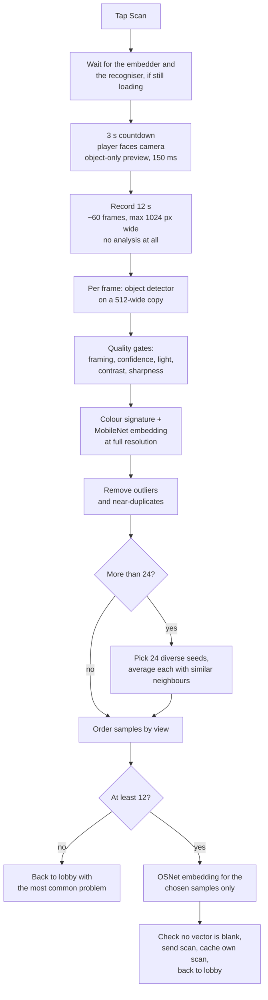

# Scanning (enrolment)

Before a round, every player is scanned so the other phones can recognise them. A scan produces a **gallery**: 12 to 24 appearance [signatures](identification.md#signatures), each from a different viewing angle, each carrying the colour features and — when the model loaded — a [re-identification embedding](identification.md#the-re-identification-embedding-reidjs). The gallery is uploaded to the server and shared with every phone in the room.

The code lives in `frontend/public/screens/scan.js`. Signature extraction itself is in [`identify.js`](identification.md).

## Who scans whom

Any phone can scan any player: each lobby row has a **Scan** button, and the gallery is saved under that player's id (`{type: 'scan', targetId, gallery}`). Usually players pair up and scan each other. The server refuses scans while a round is in countdown or playing.

`beginPlayerScan(player)` sets `state.scanTargetId`/`scanTargetName`, swaps to the scan screen, keeps the screen awake, and then — after one paint, so the screen is actually visible first — starts `runAutoScan()`.

## Pipeline



The phases and roughly what each costs:

| Phase | Duration | Work |
| --- | --- | --- |
| Model wait | Usually none | Only if the embedder or the recogniser is still loading; see below. |
| Countdown | 3 s (`ROTATION_SCAN_COUNTDOWN_MS`) | The preview detection: the object detector alone, on a 512-wide copy, at most every 150 ms. ~20 inferences. |
| Recording | 12 s (`ROTATION_SCAN_DURATION_MS`) | One `drawImage` per frame. No inference, so it stays smooth on slow phones. |
| Processing | As long as it takes | All the rest of the inference: see [the cost table](#what-processing-costs). |

Processing is not time-boxed — it runs until every recorded frame has been examined, which is why the progress counter matters.

### 0. Waiting for the models, if it comes to that

The embedder and the [recogniser](identification.md#the-re-identification-embedding-reidjs) are optional, so the lobby does not wait for them — it opens on the camera and the object detector alone ([App flow → What Continue actually waits for](app-flow.md#what-continue-actually-waits-for)). Enrolment is the one screen that does have to care, because a scan without them does not *fail*: it quietly enrols weaker signatures, and that gallery is then cached under `SCAN_CACHE_VERSION` and matched against by every phone for the rest of the round. A faster scan that enrols a worse gallery is a bad trade, and the damage persists.

So `runAutoScan()` waits for whatever is still outstanding before the countdown — never during the recording, so a rotation already under way is never interrupted — showing *"Finishing the embedder and the recogniser load..."*. In practice this is instant: reaching the scan screen takes a deliberate tap, which these downloads usually outlast. A 20 s cap (`SCAN_MODEL_WAIT_MS` in `camera.js`) means a download that stalled with no error degrades the scan rather than leaving the player stuck with nothing but the ✕.

### 1. Countdown

`runAutoScan()` clears any previous gallery and counts down from 3, re-rendering every 120 ms, so the player can get into position. The screen shows a large digit plus *"&lt;name&gt;: stand fully visible and face the camera. Start turning slowly when recording begins."*

The render loop draws a green box round whoever the scan would use, which is the confirmation that the player is in fact fully visible. That preview is the object detector alone, on the same 512-wide copy gameplay detects on, at most every 150 ms (`SCAN_PREVIEW_DETECT_INTERVAL_MS` in `screens/game.js`) — it is a highlight, not a measurement, and nothing but `drawScan` ever reads it.

### 2. Recording

`recordRotationVideo()` loops until 12 seconds have elapsed. Each iteration yields to the renderer, copies the current video frame onto a fresh in-memory canvas scaled to at most 1024 px wide (`ROTATION_FRAME_MAX_WIDTH`), then waits `ROTATION_RECORD_FRAME_MS` (180 ms). With the renderer yield on top of that wait, the real period is nearer 195 ms, so a full recording is **about 60 frames**, not the 66 the constants alone suggest.

Nothing is analysed during recording. The point is that the player gets a steady 12 seconds to turn, with no inference competing for the main thread and no dropped frames midway through the rotation. `recordRotationVideo()` sets `state.recordingScan` for the duration, which is what suppresses the preview detection above: the player has been told to turn in a circle, so the box is behind them and nobody is looking at the screen.

> This paragraph described the intent long before the code matched it. The preview detection used to run `detectScanPeople` — object detector **plus** pose landmarker — on the **full-resolution** video on every single video frame, through both the countdown and the recording: roughly 180 object and 180 pose inferences at ~0.92 Mpx, more than the whole processing pass below, none of it reaching the gallery. It also competed with the frame capture for the main thread and left the phone thermally throttled by the time processing started. The cost table below never counted any of it.

#### How much of the recording is alive at once

A recorded canvas is a backing store, and 1024×576×4 B is 2.4 MB of it. Sixty of those is **~140 MB**, and they used to be held from the moment they were captured until the end of the OSNet pass — the longest and busiest part of the scan.

That is not merely wasteful. **iOS Safari discards canvas backing stores under memory pressure, silently.** The canvas stays a live object, `drawImage` from it paints *nothing*, and reading it back gives transparent black — which the scan then describes as happily as it describes a person. `bodyGrid` normalises an all-black region to an **all-zero** `grid` vector, `validScanCache` used to accept one, the server's sanitiser accepts one, and `cosine` scores it 0 against everybody. So the player enrols, the lobby says *"Saved scan"*, and they are never recognised again — presenting as *"the scan just doesn't match"*, out of a cache that validates.

Two things follow from that, and both are in the code now:

- **A frame is released the moment it has been described**, and a usable one is replaced first by `cropFrameToBox` — a crop of just its person box, clipped exactly the way `reid.js` clips, with the box rewritten into the crop's coordinates. That crop is all the deferred OSNet pass ever reads, so the frames behind the chosen samples are still alive after selection (which is the whole point of [deferring it](#5-deferred-work-and-what-it-saves)) while everything else is gone. Canvases are resized to 1×1 rather than merely dereferenced, so the store is freed there and then instead of at the next collection. The peak is still the end of the recording — nothing can release a frame that has not been looked at yet — but through selection, thumbnail-free sample assembly and the embedding pass the resident set is the chosen crops alone, roughly a tenth of it. `?debug` reports the recording peak as `peak N MB of frames`.
- **The failure is detected rather than enrolled.** `frameLost()` scales a frame into an 8×8 probe and tests its **alpha**: a recorded frame is drawn from an opaque video frame, so a live one is alpha 255 everywhere whatever it looks like, and a discarded one is alpha 0. That is exact, and it is why the check is alpha and not brightness — a brightness test would fail a genuinely dark scan on a phone that is working fine. It guards every re-identification embed, which is the window that matters: OSNet answers a blank crop with a perfectly ordinary unit vector, identical for every blank crop and indistinguishable from a real appearance by any later check. A lost frame throws, which fails the whole scan with *"Could not process the rotation video: the browser discarded a recorded frame (out of memory)"* and enrols nothing.

A frame whose colour signature comes back all-zero fails the scan from the processing loop for the same reason, and `assertEnrollableGallery` re-checks the finished gallery before anything is sent or cached. Neither should be reachable — a fully blank frame fails the brightness gate first, and no average of describable frames is blank — which is exactly why they throw rather than filter.

Measured by [driving a whole scan](#testing) at 640×360, a frame size the harness can afford: 62 frames recorded, 57 MB of backing store at the peak, and **4.2 MB still resident during the embedding pass** — 7% of the recording. At the phone resolution the constants actually ask for (1024×576) the same scan records ~146 MB. Before this, the figure resident during the embedding pass *was* the recording.

### 3. Per-frame analysis

`processRotationVideo()` walks the recorded frames. For each one:

1. **Detect.** `detectRotationFrameBoxes()` draws the frame onto a reused canvas at most 512 px wide (`SCAN_DETECT_MAX_WIDTH`) and runs the object detector on that, scaling the resulting boxes back to full-frame coordinates. If the object detector found nobody, and only then, it retries with `detectScanPeople()` (object detector **plus** pose landmarker) to rescue the frame.
2. **Gate.** `bestUsableScanCandidate()` assesses every box and keeps the best one that passes every check in the table below. If none pass, it records the problem of the best-looking box and moves on.
3. **Describe.** For the chosen box, `extractSignature()` builds the colour signature and the MobileNet embedding, reading pixels from the **full-resolution** frame, not the 512-wide detection copy.
4. **Keep the box, drop the frame.** The signature is extracted; everything still to come needs only the person. See [How much of the recording is alive at once](#how-much-of-the-recording-is-alive-at-once).

The loop yields to the renderer every `ROTATION_PROCESS_BATCH` (3) frames rather than every frame, and updates *"Processing recorded rotation... i/N, C usable frames"* as it goes. It checks `runAutoScan`'s `live()` on every single frame, so cancelling is immediate — and so is being superseded, which `state.autoScanning` alone could not tell apart (see [Why the flag alone is not enough](#why-the-flag-alone-is-not-enough)).

Step 2's gate is the *only* place framing is judged: a candidate whose `problem` is `'ok'` has already passed `scanBoxProblem`, which is the same `boxQuality(…, MIN_SCAN_HEIGHT_RATIO, {scan: true})` call `usableScanBox` makes, so asking again per frame was pure repetition.

Re-identification embeddings are **not** computed here — see [Deferred work](#5-deferred-work-and-what-it-saves).

#### Quality gates

Checked in this order; the first failure is the frame's recorded problem. The message column is what `scanProblemMessage()` turns the code into, which the player sees in the lobby if the scan ends up short.

| Check | Problem code | Rule | Player-facing message |
| --- | --- | --- | --- |
| Anything detected | `no-person` | No box at all for this frame | *no person detected* |
| Size | `too-far` | Box height under 18% of the frame (`MIN_SCAN_HEIGHT_RATIO`), or width under 2.5% (`MIN_SCAN_BOX_WIDTH_RATIO`) | *step a little closer* |
| Shape | `partial-body` | Height/width ratio outside 0.65–7.0 (`MIN_SCAN_ASPECT`/`MAX_SCAN_ASPECT`) | *stand straighter or show more of your body* |
| Framing | `edge-clipped` | Box touches a frame edge and is under 42% of frame height (`CLIPPED_OK_SCAN_HEIGHT_RATIO`) | *move fully inside the frame* |
| Detector confidence | `low-confidence` | Score below 0.16 (`SCAN_MIN_DETECTION_SCORE`) | *keep your body clearer in the camera* |
| Brightness | `low-light` / `overexposed` | Mean brightness below 0.08 or above 0.94 | *move into brighter light* / *avoid strong backlight* |
| Contrast | `low-contrast` | Brightness standard deviation below 0.025 | *use a less flat background or better light* |
| Sharpness | `motion-blur` | Mean neighbouring-pixel difference below 0.0035 | *turn a little slower* |

The first three (plus `no-person`) come from `scanBoxProblem()` in `identify.js` and are pure arithmetic on the box. The last four need pixels: `scanImageStats()` draws the middle of the box onto a 32×48 canvas and reads it once, computing brightness, contrast and sharpness together from that single read.

That window is `subBox(box, 0.08, 0.06, 0.84, 0.88)` — deliberately the same window `bodyGrid()` reads, so the gate measures the pixels the signature is built from. It has to be clipped to the frame the same way too, and it was not: `scanImageStats` subtracted nothing from the width and height when the window started outside the frame, where `readPixels` in `identify.js` subtracts the clipped amount. For a box overhanging the left or top edge that made the measured window a *shifted* one — wider, and over pixels the signature never saw. Only reachable for a clipped box tall enough to pass `CLIPPED_OK_SCAN_HEIGHT_RATIO`, which is to say a player filling the frame, and silent when it happened: the frame was judged on light and sharpness it did not have.

Candidate **quality** — used throughout selection — rewards boxes that are large, tall, near the centre (specifically centred on 50% across, 53% down), confidently detected, contrasty and sharp. It is a score, not a gate: a frame that passes every check still loses to a better-framed one.

### 4. Sample selection

`selectRotationSamples()` turns maybe 40–60 usable frames into a compact, varied gallery. It lives in [`frontend/public/scan-select.js`](../../frontend/public/scan-select.js) rather than in the screen, for two reasons: it is the one phase of a scan with no camera, canvas or inference in it, and `screens/scan.js` is awkward to reach from a test (see [Testing](#testing)). Its thresholds are passed in, so the scan's tuning stays at the top of the screen and a test can choose its own numbers rather than assert a constant against itself.

**It yields.** Selection is pure arithmetic, so it used to run to completion in a single task — tens of thousands of similarity computations between the two `performance.now()` calls that measure it — and for however long that took on the phone, the progress line was frozen and the ✕ did nothing. Every loop now reports the work it did to a cooperative ticker that hands the renderer a frame every `SCAN_SELECT_YIELD_WORK` (4 000) comparisons, and the pass takes `runAutoScan`'s `live()`: a cancel, or being superseded, returns `null` rather than a half-selected gallery. `?debug`'s `sel` figure is wall clock and so now includes those yields, which is what a responsive ✕ costs.

"Similarity" throughout this step is `signatureSimilarity()`: the mean cosine similarity of the **upper-body histogram, lower-body histogram and grid** only. That is deliberate, and worth understanding — it is the colour features, *not* the re-identification embedding. This step is about spotting *different views of the same person*, and a model trained to be view-invariant would rate every angle alike and defeat the diversity selection. It is also what makes deferring the OSNet work safe: selection genuinely cannot see `reid`.

1. **Remove outliers** (`removeScanOutliers`, skipped when there are 12 or fewer candidates): score each frame by the average similarity of its 4 nearest neighbours, and drop anything below 0.36 (`SCAN_OUTLIER_SIMILARITY`). These are usually a different person who wandered through, or a badly placed box. If that would leave fewer than 12, the step is abandoned and the 12 highest-quality frames are kept instead.
2. **Remove near-duplicates** (`removeScanDuplicates`): walk the frames best-quality-first and keep one only if it is less than 0.992 similar (`SCAN_DUPLICATE_SIMILARITY`) to everything already kept. If that leaves fewer than 12, the un-deduplicated set is used instead. The threshold is this high on purpose — it removes frames that are *all but identical*, not merely similar ones.
3. **If 24 or fewer remain**, they are the samples, one frame each, and step 4 is skipped entirely.
4. **If more than 24 remain**, pick seeds and average:
   - **Diversity weighting** (`selectDiverseRotationSeeds`): greedily pick 24 seeds, each time taking the frame with the best `quality + (1 − closest similarity to an already-picked seed) × 0.42` (`SCAN_DIVERSITY_WEIGHT`). So a slightly worse frame of an angle nobody has yet beats a great frame of an angle already covered.

     The "closest similarity to an already-picked seed" is carried forward, not recomputed. It used to be re-derived from scratch for every candidate on every iteration — pool × selected comparisons each time, about **34 000** of them over 24 iterations with 60 candidates, which was the single biggest reason the ✕ was unresponsive — and the answer was always exactly the previous iteration's value max'd against the seed just taken. So that is what it is: one comparison per surviving candidate per iteration, ~1 400 instead of ~34 000, choosing the same seeds in the same order. The entries move with their candidate when the pool is spliced, so even the first-index tie-break is unchanged.
   - **Averaging** (`averagedRotationSample`): each seed is averaged with up to 3 other frames at least 0.74 similar to it (`SCAN_VIEW_AVERAGE_SIMILARITY`, `ROTATION_SAMPLE_AVERAGE_COUNT` 4 including the seed), ranked by similarity with a small quality tiebreak. `averageSignatures()` averages every vector field, re-normalising all of them except `shape` (which has to stay on its raw scale), which smooths out per-frame sensor noise. The sample keeps the seed's box and timestamp, and the group's mean quality.

     **The seed is always in its own average.** It used to be ranked alongside the others on `similarity + quality × 0.05` and then cut by the same `slice`, so four better-scoring candidates could push a seed out of its own group — while the sample still spread `...seed` over itself and kept the seed's frame and box, which is the frame the re-identification pass then embeds. A sample whose own seed frame is not in its signature is not what anything downstream assumes.
5. **Order by view** (`orderRotationSamplesByView`): start with the best-quality sample and repeatedly append the most similar remaining one, which roughly reconstructs the order the player turned in.

Note the asymmetry: with ≤24 clean candidates every sample is a single frame, and with >24 every sample is an average of up to 4. Both are valid galleries.

### 5. Deferred work, and what it saves

One thing is computed only for the samples that survived selection, because only those are ever used:

- **The re-identification embedding.** `attachSampleReid()` in [`scan-reid.js`](../../frontend/public/scan-reid.js) runs OSNet on each frame that backs a chosen sample and writes the average into `signature.reid`. A sample averaged from 4 frames gets the average of those 4 frames' embeddings, exactly as before; a single-frame sample gets that frame's embedding. A frame shared between two samples is embedded once and reused. Skipped entirely when the scan is already too short to be usable, and when `state.reid` is null because the model failed to load.

  The embeddings are **dispatched four at a time** (`REID_DISPATCH_BATCH`) with a renderer yield between batches, rather than one at a time with a yield in front of each. `reid.js` runs OSNet in a Web Worker (`ort.env.wasm.proxy`) and queues one inference at a time internally, so the only main-thread cost of an `embed()` call is the crop it snapshots synchronously before handing over — which meant the old shape left the worker idle for most of a renderer frame per embedding, about half a second of nothing across a 30-frame scan. Batching keeps the worker fed; the batch size is only about how long an uninterrupted run of snapshots may be. What lands in the gallery is identical, and `test/scan-reid.test.js` embeds a fixed fixture through both this and a serial reference and compares the vectors, because that is the regression that would matter.

  Each embed is guarded by `frameLost()` first: this is the longest window in which a frame can be taken away, and the one case nothing downstream could catch. See [How much of the recording is alive at once](#how-much-of-the-recording-is-alive-at-once).

#### Thumbnails: removed, not hidden

A 48×64 JPEG used to be cropped from every chosen sample's frame, measured as its own phase, stored in `state.scanThumbs`, and persisted into the cache. **None of it could ever be seen.** `#scan-thumbs` lives inside `#scan-screen`, and every exit from a scan goes through `showLobby()`, which hides that screen — including the too-few-angles path, where a comment claimed the strip was the feedback. `loadScanCache`'s only consumer reads `cache.gallery`; `cache.thumbs` was `Array.isArray`-checked and never read. So up to 24 JPEG encodes, their timing, and their storage bought nothing.

Given the choice between making them visible and not computing them, they are gone. Making them visible means a post-scan review screen — a feature with its own design, not a repair — and the strip's one interaction (`appendScanThumb`'s click handler: *"tap to redo this and later angles"*) belongs to the retired incremental-capture flow and is meaningless for a single rotation. A deliberate, visible version can be added later; silently computing one was the thing to stop. `#scan-thumbs` and its CSS are still in the page, unused, because they are not this change's files to remove.

This ordering is what makes the embedding affordable. OSNet is the single most expensive inference in the app, and selection cannot see its output, so embedding every usable frame meant paying for it on every frame that selection then threw away. The gallery is unchanged — the same frames are embedded and averaged the same way — but far fewer frames are embedded.

#### What processing costs

Measured by driving the real `processRotationVideo()` over 60 synthetic recorded frames, all of them usable, selecting 24 samples backed by 30 distinct frames:

| Per scan | Before `scan-optimisation` | After `scan-optimisation` |
| --- | --- | --- |
| Object detector inferences | 60, on a 720×1280 (~0.92 Mpx) frame | 60, on a 512×910 (~0.47 Mpx) copy |
| Pose landmarker inferences | 60, same full-size frame | **0** — only frames the object detector found nobody in |
| MobileNet embeddings | 60 | 60 (unchanged; it wants the good pixels) |
| **OSNet re-identification inferences** | **60** | **30** |
| JPEG thumbnail encodes | 60 | 24, and **0** since they were [removed](#thumbnails-removed-not-hidden) |
| `getImageData` calls | 300–360 | 270 |
| Pixels read back via `getImageData` | ~2.11 M | ~1.13 M |
| Renderer yields | 60 | 50 (20 in the loop, 30 in the embedding pass), plus a handful in [selection](#4-sample-selection), which used to yield none |

Total model inferences in the processing pass: **240 → 150**, and the two classes that shrank are the two most expensive per call. (The `getImageData` range before the change is because `detectScanPeople` returned an object box *and* a pose box, so the quality gates sometimes read stats for two boxes per frame instead of one.)

#### What the rest of the scan costs

That table only ever covered `processRotationVideo()`. Counting the whole scan screen, which is what the player actually waits through:

| Per scan | Before `startup-latency` | After |
| --- | --- | --- |
| Preview object detector inferences | ~180, on the **full-resolution** video | ~20, on a 512-wide copy, countdown only |
| Preview pose landmarker inferences | ~180, same full-resolution video | **0** |
| Processing-pass inferences | 150 | 150 (unchanged) |
| **Model inferences per scan, total** | **~510** | **~170** |
| Renderer frames in which OSNet is idle waiting to be given work | ~30 | ~8 |

The preview counts are a rate estimate, not a measurement: the old code ran once per *new video frame*, so the real number depends on the camera's frame rate and on how long each full-resolution object+pose pair took on that particular phone — the two fight each other, which is why it is a range in the field. On a 30 fps camera where the pair costs ~80 ms the loop self-limits to about 12 pairs a second, hence ~180 across 15 seconds. The direction is not in doubt even if the exact figure is.

With `?debug`, `scanCostLine()` puts the **actual** counts and per-phase timings on the overlay after every scan, so this can be read off a real phone rather than estimated: see [Debug mode](../development/debug-mode.md#startup-and-scan-costs).

#### What was considered and rejected

**Moving the MobileNet embedding after selection**, the way OSNet's was. Selection genuinely cannot see `signature.embed` — `signatureSimilarity()` averages `hist`, `lower` and `grid` only — so this is sound in principle, and it is the obvious next move. It does not pay here. MobileNet runs on every *usable* frame, ~55 of 60; the frames backing the chosen samples are ~30 of those; so the saving is ~55 → ~30 embeddings. But there is no way to ask `identify.js` for *only* the embedding of a frame — `personEmbedding()` is private, and `extractSignature()` computes the colour features and the embedding together or neither (`appearance: false` skips both). So the deferred pass would have to call `extractSignature()` again for each of ~30 frames, recomputing colour features that were already computed and thrown away, including three `getImageData` read-backs each. Trading ~25 MobileNet inferences for ~30 redundant colour-feature extractions is not obviously a win and may be a loss. Doing it properly needs a narrower seam in `identify.js`.

**OSNet's threads.** `reid.js` asks for `min(4, hardwareConcurrency)` WASM threads, but only when `crossOriginIsolated` — which needs COOP and COEP on the document. Nothing served them until `frontend/cross-origin-isolation.conf`, so until then OSNet ran single-threaded on every device and the threaded WASM build in the image was doing the plain build's work. The inferences dominate the embedding pass, so this was the largest remaining win here, and it was a header change rather than a code change. The actual speedup is **not yet measured on a phone**; `?debug` reports the thread count and the per-scan inference timings.

How the OSNet figure holds up, since it is the headline: the count after the change is the size of the union of the backing sets of the 24 chosen samples. That is bounded above by `24 × 4 = 96` and by the number of clean candidates, so with ~60 frames the bound alone guarantees nothing — it had to be measured. Running the real `selectRotationSamples()` over synthetic rotations (colourful, neutral and high-contrast outfits, 24–66 usable frames) the union **saturates at 27–30 frames** once there are more than ~40 candidates, because the 24 seeds' neighbour groups overlap heavily. It is also guaranteed never to be *worse*: every backing frame is a candidate, and each is embedded at most once.

One case costs more than before: a scan where the object detector keeps finding nobody — the player out of frame, or far too dark — pays two object-detector passes plus a pose pass on each of those frames, instead of one of each. That scan was going to fail its 12-sample floor anyway, and it buys the good scans a pose inference saved on every frame.

The resolution change is more modest than it looks. EfficientDet-Lite0, the pose landmarker and MobileNetV3 all resize their input to a fixed internal size, so detecting on a 512-wide copy instead of a 1024-wide one does **not** reduce the network's work — it reduces the per-inference image upload and internal resize by 4×, at the cost of one extra `drawImage` per frame. The pose-landmarker and OSNet reductions are the real wins.

### 6. Result

- **12 or more samples** (`SCAN_MIN_SAMPLES`): every sample is checked for a blank vector (`assertEnrollableGallery`), the gallery is sent to the server as `{type: 'scan', targetId, gallery}`, and the phone returns to the lobby with *"Saved scan for &lt;name&gt; with N angles."* If the scanned player is the local one, the gallery is also kept in `state.localGallery` and [cached](#local-cache).

  *"Saved scan"* used to be said whether or not the gallery ever left the phone. `send()` hands the message to whatever connection is there, so a scan sent down one that had gone away was a twelve-second rotation the player was told had worked and that no other phone ever saw — and the local cache made it look right on this phone too. `saveCurrentScan` now takes whatever `send()` reports back and corrects the lobby line if the scan turns out not to have arrived, while the player is still reading it.
- **Fewer than 12:** the phone returns to the lobby with *"Only got N/12 usable angles from U/T frames: &lt;hint&gt;. Try again slower."* — where `U` is usable frames, `T` total recorded, and the hint is the message for the **most frequent** problem code (`mostCommonProblem`), falling back to the last one seen. Nothing is sent or cached. The player-facing version of this list is in [How to play](../how-to-play.md#scanning-a-player).
- **An exception anywhere** in recording or processing: *"Could not process the rotation video: &lt;error&gt;."* A failed OSNet inference lands here, so one model error fails the whole scan rather than producing a gallery with some embeddings missing — and so does a [frame the browser took away](#how-much-of-the-recording-is-alive-at-once), which is the whole point of that check: the alternative is not a failed scan, it is a successful one describing a blank rectangle.

## What a gallery sample contains

A gallery is an array of signature objects — exactly what `extractSignature()` produces, with `reid` added afterwards. Nothing else from the scan (boxes, quality scores, frame timestamps, source frames) leaves `scan.js`.

| Field | Length | Used for |
| --- | --- | --- |
| `hist` | 64 | Upper-body colour. **Both** sample selection (via `signatureSimilarity`) and live matching. The main angle-invariant colour signal. |
| `lower` | 64 | Lower-body colour. Selection and live matching. A false-positive guard: a similar shirt is not enough if the trousers differ. |
| `grid` | 192 | Coarse colour/shape grid. Selection and live matching. Changes with viewing angle, which is exactly why selection uses it to tell angles apart. |
| `shape` | 2 | Box proportions, stored **raw** rather than L2-normalised like the rest (it is compared as a log ratio of aspects, so its scale carries meaning — see [Identification → Signatures](identification.md#signatures)). Live matching only, as a guard — **not** part of `signatureSimilarity`, so it has no say in which samples are chosen. |
| `embed` | 256, or `[]` | MobileNet embedding. Live matching only, blended with the colour parts when no `reid` is available on both sides. Not used by selection. |
| `reid` | 512, or `[]`/absent | OSNet embedding. Live matching only, where it **overrides** every other field. Not used by selection — this is what makes deferring it safe. |
| `usable` | bool | Whether the box was big and whole enough to trust. Dropped by the server's sanitiser rather than stored. |

The three fields selection actually reads are `hist`, `lower` and `grid`. Everything else is there for the game.

See [Identification → Signatures](identification.md#signatures) for how each vector is computed and [Identification → Comparing a signature to one player](identification.md#comparing-a-signature-to-one-player) for how they are weighed at match time.

## Cancelling

The **✕** button cancels at any point — countdown, recording, per-frame processing or the embedding pass. It sets `state.autoScanning = false`, **retires the run token**, and returns to the lobby with *"Scan cancelled."*

Every loop in the scan path checks that flag on each iteration and returns `null` rather than a partial result, and `runAutoScan()` only touches `state.gallery` once it holds a non-null result. So a cancel can never leave a half-built gallery behind: nothing is sent, nothing is cached, and the player keeps whichever gallery they already had. The `finally` blocks notice `state.mode` is no longer `'scan'` and leave the lobby's message alone.

### Why the flag alone is not enough

`state.autoScanning` means "a scan is running", and both `cancelScan()` and `beginPlayerScan()` clear
it. So the flag cannot tell a *cancelled* run from a *superseded* one: a run parked on an await —
`whenScanModelsReady()` can hold for up to `SCAN_MODEL_WAIT_MS` — would see the flag set back to
`true` by the next scan, pass its own liveness check, and run to completion under whoever is being
scanned **now**. Because `saveCurrentScan` used to read `state.scanTargetId` at save time, that
finished as one player's gallery sent and cached under another player's id, mislabelling them for
the rest of the round. Its `finally` would also have cleared the flag out from under the scan that
replaced it, silently killing that one too.

So each run takes a token (`scanRun`), captures its `targetId` up front, and re-checks
`run === scanRun` after every await; `cancelScan()` bumps the token so a parked run dies even when
no rescan follows, and the `finally` touches the shared flags only if its run is still the live one.
That `live()` predicate is now handed to the recording, processing, selection and embedding passes
too, so a superseded run stops at its next loop iteration instead of spending the phone's one
thread on a gallery its caller is going to throw away.

`test/scan-run-token.test.js` pins the shape of the fix in the source, and says plainly that it
cannot drive the sequence. `test/scan-enrolment.test.js` now can: it starts a scan of one player,
starts a scan of another mid-flight, and asserts exactly one gallery is sent, under the live run's
id, with no self gallery or cache left behind by the run that was replaced.

Up to `REID_DISPATCH_BATCH` (4) in-flight OSNet inferences may still finish after a cancel — they are awaited, not abortable — but their results are discarded and no further batch is dispatched. The lobby appears immediately regardless: `cancelScan()` changes the screen synchronously, and the draining happens behind it.

## Local cache

The logic lives in [`frontend/public/scan-cache.js`](../../frontend/public/scan-cache.js); `screens/scan.js` keeps the `localStorage` calls.

**Only this phone owner's own scan is cached**, under `laser-tag:scan:self:<room>`. When you join, that cache is sent with the `join` message, so a reload does not mean rotating again. A scan of anybody else is the server's to keep and comes back in the roster; nothing has ever read a non-self cache entry.

### Why the name is not in the key

It used to be. The slot was `laser-tag:scan:<room>:<lower-cased name>`, and `validScanCache` compared `cache.name === scanPersonName()`. `state.scanTargetId` addressed the `send()` and **never the cache** — and nothing makes a name unique: `clean_name` on the server only trims to 20 characters, and two players may both be "Sam".

So, in a room with two Sams: you scan the *other* Sam on your phone, and `saveScanCache` writes her gallery to `laser-tag:scan:demo:sam`. On any later rejoin, [`screens/join.js`](../../frontend/public/screens/join.js) calls `loadScanCache()` with `scanTargetName` cleared, so `scanPersonName()` falls back to `state.name` — *"Sam"*. Version, name and room all match. `state.localGallery` becomes her appearance, `sendJoin` publishes it as **yours**, and for the rest of the round every phone in the room matches her body to your name while your own phone `selfReject`s any track that looks like her. Nothing about it is visible at any point.

A second, smaller defect sat in the same two functions: the key lower-cased the name and the check compared it case-sensitively, so "Alex" and "alex" shared one slot and each silently invalidated the other's cache.

The fix is that identity is the **player id**, consulted in exactly one place — `cacheableScan({targetId, selfId})`, which is true only for your own scan — and the key is the room alone. The id is deliberately *not* in the key either: the room hands out a fresh id whenever the resume id has gone, which is precisely the reload the cache exists to survive. *"The owner of this phone, in this room"* is the honest identity for the only entry anybody reads. The name is still stored, for the debug overlay, and is never an identity check again.

Two consequences worth knowing:

- A different person using the same phone in the same room inherits the cache. That is a far narrower hole than a shared first name, and it is what `resumePlayerId` already assumes about a device.
- Scan caches are the largest thing this app puts in `localStorage` (~190 KB a gallery) and nothing used to remove one, so they accumulated per room *and* per name until `setItem` threw `QuotaExceededError` — which `saveScanCache` swallows, leaving a phone that silently stops remembering. `staleScanCacheKeys` now drops every other scan key on save, which also clears out the version-12 name-keyed entries that may hold the wrong person entirely.

### What `validScanCache()` requires

- `version === SCAN_CACHE_VERSION`
- `room` matches the current room (the name is **not** checked — see above)
- `gallery` is an array of 12–24 samples
- every sample's `hist`, `lower`, `grid` and `shape` is an array that is **not empty, not all zero, and all finite**

That last clause used to be `Array.isArray` and nothing else, so a sample with `hist: []` validated. `bestAngleScore` then skipped every sample, `matchGallery` returned `null` for that player for the whole round — and `rosterCandidateCount`/`missingScanPlayers` still counted them as scanned, so the lobby let the round launch. An all-zero vector is the reachable version of the same hole: see [How much of the recording is alive at once](#how-much-of-the-recording-is-alive-at-once). `embed` and `reid` are deliberately exempt — either can legitimately be empty on a phone where the optional model failed to load, which is the same graceful degradation the live path has.

### The `join.js` change this still wants

`enterLobbyFromForm` calls `loadScanCache()` for the side effect of pre-filling `state.localGallery`, and that is now safe: the only entry it can find is this phone owner's own. But it calls it **before** `connect()`, i.e. before the room has said who you are, which means the cache cannot be checked against the id the server ends up giving you. If `join.js` is ever reworked, the honest shape is to pass what it knows:

```js
// screens/join.js, in place of the bare loadScanCache() call
state.savedScan = loadScanCache({ resumePlayerId });
```

…with `loadScanCache` ignoring a cache whose `playerId` is set and does not match a supplied `resumePlayerId`. That would close the same-phone-different-person case for the auto-rejoin path, which is the one path where the id *is* known up front (`loadActiveLobby()` supplies it). It is not needed for the bug above and `join.js` belongs to another change, so it is written down rather than done.

### Why the version exists

A cached gallery is compared against signatures extracted by whatever code is running *now*. If the signature format changes — a new field, different bin counts, a different region of the body, a different weighting — old samples are not merely stale, they are **silently wrong**: cosine similarity against a vector built by different code still returns a number, so matching degrades instead of failing. Bumping `SCAN_CACHE_VERSION` is what forces those caches to be discarded and the player to rescan.

The current version is **13**, and it exists for an identity change rather than a format one: a version-12 entry is keyed by name, so it may have been written by a scan of a *different* player who happened to share it. That is the silent failure above in its worst form — the cache does not merely degrade matching, it labels the wrong body with your name — so those entries are discarded rather than migrated.

Version 12 stored `shape` raw instead of L2-normalised: a version-11 `shape` is a unit vector, and the corrected comparison reads it as a wildly wrong aspect ratio rather than failing ([the bug report](../shape-feature-bug.md)). Version 11 was the one whose samples carry a `reid` embedding; bumping to it is what discarded the pre-re-identification caches.

Note that the required-field check does *not* include `reid`. A cache saved on a phone where OSNet failed to load is still valid — it just produces weaker matching for that player, which is the same graceful degradation the live path has.

## Testing

Enrolment had no behavioural test for a long time, for a concrete reason: `screens/scan.js` could not be imported under Node at all. It reaches `detector.js`, which imports `/vendor/tasks-vision/vision_bundle.mjs` — an absolute URL the dev server serves and Node refuses — and `env.js` touches `document.getElementById` and `canvas.getContext('2d')` at module scope, so there is nothing to mock *after* the import. The heaviest and most consequential path in the app was therefore reasoned about rather than exercised, which is how a cache keyed by a non-unique name survived.

Two helpers remove that excuse:

- [`test/helpers/vendor-hooks.js`](../../test/helpers/vendor-hooks.js) — a module resolve hook mapping `/vendor/...` onto a stub. Register it before importing anything downstream of `detector.js`.
- [`test/helpers/fake-dom.js`](../../test/helpers/fake-dom.js) — the DOM `env.js` reaches, plus a clock that makes a 3 s countdown and a 12 s recording take microseconds. Its canvases carry real RGBA pixels and really resample them in `drawImage`, because the quality gates measure brightness, contrast and sharpness and a flat colour would be thrown out as `low-contrast` — which would make the gates the thing under test. And a canvas can be **discarded**: still a live object, `drawImage` from it paints nothing, reading it back gives transparent black. That is the iOS behaviour this page keeps describing, modelled.

On top of them:

| File | What it covers |
| --- | --- |
| [`test/scan-enrolment.test.js`](../../test/scan-enrolment.test.js) | Whole scans. Who the gallery is sent and cached under, what a shared name does and does not do, a rotation whose frames were discarded, a frame lost between selection and the embedding pass, a red-free frame *not* being mistaken for a lost one, how much canvas is still resident during the embedding pass, a superseded run, and a cancel. |
| [`test/scan-cache.test.js`](../../test/scan-cache.test.js) | `scan-cache.js` directly: the key, what may be cached, and every way a sample can be blank. Its bounds are the test's own numbers, not the screen's constants. |
| [`test/scan-select.test.js`](../../test/scan-select.test.js) | `scan-select.js` directly: that the pass yields and yields more as the pool grows, that a cancel produces nothing, that carrying `nearest` forward picks the same seeds a recomputing reference picks, and that a seed is in its own sample. |
| [`test/scan-reid.test.js`](../../test/scan-reid.test.js) | `scan-reid.js`: that the batched pass produces byte-for-byte the gallery the serial one did, and what a cancel or a failed inference does. |
| [`test/scan-run-token.test.js`](../../test/scan-run-token.test.js) | The run-token discipline, as assertions on the shipped source — the properties the fix rests on, each of which would silently regress the bug. |

Note what is real in the enrolment tests and what is not. Real: `scan.js`, `scan-select.js`, `scan-cache.js`, `identify.js`, `detector.js`'s box plumbing, and every threshold. Faked: the camera's pixels, the object detector's answer, the OSNet embedder, and the clock.

Two things these tests deliberately do **not** prove, because nothing can reach them from outside: the processing loop's all-zero-signature throw and `assertEnrollableGallery`. A fully blank frame fails the brightness gate first, and no average of describable frames is blank, so both are invariants rather than reachable paths — which is why they throw instead of filtering. Their predicate (`degenerateSignature`) is unit-tested.

### Mutation-check anything added here

Every test in this area was written by breaking the behaviour it claims to guard, watching it fail, and restoring. That is not ceremony: on the pass that produced these files, **ten of twenty-one** mutations ran green first time, and each one was either a test asserting less than it looked like it did or a piece of code that turned out to be redundant. Two examples worth remembering:

- A memory ceiling expressed as *a fraction of the recording* passed with every candidate's crop still alive, because the crops are small enough that keeping all of them still came in under the fraction. Expressed against the number of frames the embedding pass actually reads, it fails.
- `frameLost` reading a colour channel instead of alpha passed everything, because a discarded canvas is zero in every channel. Only a *live* frame with no red in it separates the two.

And two mutations that ran green because the code they broke was genuinely redundant, which is worth knowing rather than papering over: `cancelScan()`'s `scanRun++` and `live()`'s `state.autoScanning` check are two halves of one guarantee — every path that clears the flag also starts a run that retires the token — so either alone stops a parked run. Both are kept as belt and braces, but no test can distinguish them, and one claiming to would be asserting nothing.

## Server-side limits

The server keeps at most 24 samples per gallery and truncates each feature vector to a fixed length, including `reid` at 512. `usable` is not in `GALLERY_FIELDS`, so it is dropped. See [Protocol → Gallery format](../server/protocol.md#gallery-format).

## Tuning

All scan constants (`SCAN_*`, `ROTATION_*`) are at the top of `frontend/public/screens/scan.js`, including the ones the selection pass uses — `scan-select.js` takes them as arguments rather than importing them, so there is still one place to tune. The exceptions are `SCAN_CACHE_VERSION` (in `scan-cache.js`, next to the rules that decide what a version means), `SCAN_SELECT_YIELD_WORK` (in `scan-select.js`, which is about responsiveness rather than gallery quality) and `REID_DISPATCH_BATCH` (in `scan-reid.js`). See [Configuration → Scanning](../development/configuration.md#scanning).
