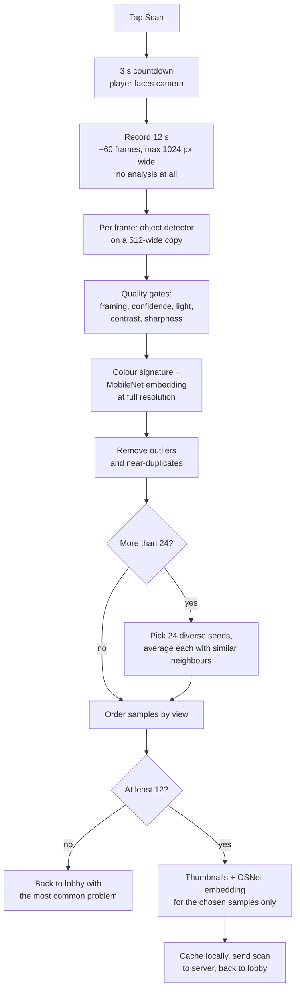

# Scanning (enrolment)

Before a round, every player is scanned so the other phones can recognise them. A scan produces a **gallery**: 12 to 24 appearance [signatures](identification.md#signatures), each from a different viewing angle, each carrying the colour features and — when the model loaded — a [re-identification embedding](identification.md#the-re-identification-embedding-reidjs). The gallery is uploaded to the server and shared with every phone in the room.

The code lives in `frontend/public/screens/scan.js`. Signature extraction itself is in [`identify.js`](identification.md).

## Who scans whom

Any phone can scan any player: each lobby row has a **Scan** button, and the gallery is saved under that player's id (`{type: 'scan', targetId, gallery}`). A scanned row also has a **✕** that, after a confirm prompt, deletes the scan for everyone (`{type: 'clearScan', targetId}`); every phone then forgets its cached copy of it (`forgetScanCache`). Usually players pair up and scan each other. The server refuses scans while a round is in countdown or playing.

`beginPlayerScan(player)` sets `state.scanTargetId`/`scanTargetName`, swaps to the scan screen, keeps the screen awake, and then — after one paint, so the screen is actually visible first — starts `runAutoScan()`.

## Pipeline

The three phases and roughly what each costs:

| Phase | Duration | Work |
| --- | --- | --- |
| Countdown | 3 s (`ROTATION_SCAN_COUNTDOWN_MS`) | None. A digit counting down and a prompt. |
| Recording | 12 s (`ROTATION_SCAN_DURATION_MS`) | One `drawImage` per frame. No inference, so it stays smooth on slow phones. |
| Processing | As long as it takes | All of the inference: see [the cost table](#what-processing-costs). |

Processing is not time-boxed — it runs until every recorded frame has been examined, which is why the progress counter matters.

### 1. Countdown

`runAutoScan()` clears any previous gallery and counts down from 3, re-rendering every 120 ms, so the player can get into position. The screen shows a large digit plus *"&lt;name&gt;: stand fully visible and face the camera. Start turning slowly when recording begins."*

### 2. Recording

`recordRotationVideo()` loops until 12 seconds have elapsed. Each iteration yields to the renderer, copies the current video frame onto a fresh in-memory canvas scaled to at most 1024 px wide (`ROTATION_FRAME_MAX_WIDTH`), then waits `ROTATION_RECORD_FRAME_MS` (180 ms). With the renderer yield on top of that wait, the real period is nearer 195 ms, so a full recording is **about 60 frames**, not the 66 the constants alone suggest.

Nothing is analysed during recording. The point is that the player gets a steady 12 seconds to turn, with no inference competing for the main thread and no dropped frames midway through the rotation.

All ~60 canvases are held in memory for the whole scan — a few megabytes of backing store each at phone camera resolutions, so a couple of hundred MB in total. They have to be: selection happens after the loop, and the chosen samples are then re-read from their original frames for their thumbnail and their embedding.

### 3. Per-frame analysis

`processRotationVideo()` walks the recorded frames. For each one:

1. **Detect.** `detectRotationFrameBoxes()` draws the frame onto a reused canvas at most 512 px wide (`SCAN_DETECT_MAX_WIDTH`) and runs the object detector on that, scaling the resulting boxes back to full-frame coordinates. If the object detector found nobody, and only then, it retries with `detectScanPeople()` (object detector **plus** pose landmarker) to rescue the frame.
2. **Gate.** `bestUsableScanCandidate()` assesses every box and keeps the best one that passes every check in the table below. If none pass, it records the problem of the best-looking box and moves on.
3. **Describe.** For the chosen box, `extractSignature()` builds the colour signature and the MobileNet embedding, reading pixels from the **full-resolution** frame, not the 512-wide detection copy.

The loop yields to the renderer every `ROTATION_PROCESS_BATCH` (3) frames rather than every frame, and updates *"Processing recorded rotation... i/N, C usable frames"* as it goes. It checks `state.autoScanning` on every single frame, so cancelling is still immediate.

Thumbnails and re-identification embeddings are **not** computed here — see [Deferred work](#5-deferred-work-and-what-it-saves).

#### Quality gates

Checked in this order; the first failure is the frame's recorded problem. The message column is what `scanProblemMessage()` turns the code into, which the player sees in the lobby if the scan ends up short.

| Check | Problem code | Rule | Player-facing message |
| --- | --- | --- | --- |
| Anything detected | `no-person` | No box at all for this frame | *no person detected* |
| Size | `too-far` | Box height under 18% of the frame (`MIN_SCAN_HEIGHT_RATIO`), or width under 2.5% (`MIN_SCAN_BOX_WIDTH_RATIO`) | *step a little closer* |
| Shape | `partial-body` | Height/width ratio outside 0.65–7.0 (`MIN_SCAN_ASPECT`/`MAX_SCAN_ASPECT`) | *stand straighter or show more of your body* |
| Framing | `edge-clipped` | Box touches a frame edge and is under 42% of frame height (`CLIPPED_OK_SCAN_HEIGHT_RATIO`) | *move fully inside the frame* |
| Detector confidence | `low-confidence` | Score below 0.16 (`SCAN_MIN_DETECTION_SCORE`) | *keep your body clearer in the camera* |
| Brightness | `low-light` / `overexposed` | Mean brightness below 0.08 or above 0.94 | *move into brighter light* / *avoid strong backlight* |
| Contrast | `low-contrast` | Brightness standard deviation below 0.025 | *use a less flat background or better light* |
| Sharpness | `motion-blur` | Mean neighbouring-pixel difference below 0.0035 | *turn a little slower* |

The first three (plus `no-person`) come from `scanBoxProblem()` in `identify.js` and are pure arithmetic on the box. The last four need pixels: `scanImageStats()` draws the middle of the box onto a 32×48 canvas and reads it once, computing brightness, contrast and sharpness together from that single read.

Candidate **quality** — used throughout selection — rewards boxes that are large, tall, near the centre (specifically centred on 50% across, 53% down), confidently detected, contrasty and sharp. It is a score, not a gate: a frame that passes every check still loses to a better-framed one.

### 4. Sample selection

`selectRotationSamples()` turns maybe 40–60 usable frames into a compact, varied gallery.

"Similarity" throughout this step is `signatureSimilarity()`: the mean cosine similarity of the **upper-body histogram, lower-body histogram and grid** only. That is deliberate, and worth understanding — it is the colour features, *not* the re-identification embedding. This step is about spotting *different views of the same person*, and a model trained to be view-invariant would rate every angle alike and defeat the diversity selection. It is also what makes deferring the OSNet work safe: selection genuinely cannot see `reid`.

1. **Remove outliers** (`removeScanOutliers`, skipped when there are 12 or fewer candidates): score each frame by the average similarity of its 4 nearest neighbours, and drop anything below 0.36 (`SCAN_OUTLIER_SIMILARITY`). These are usually a different person who wandered through, or a badly placed box. If that would leave fewer than 12, the step is abandoned and the 12 highest-quality frames are kept instead.
2. **Remove near-duplicates** (`removeScanDuplicates`): walk the frames best-quality-first and keep one only if it is less than 0.992 similar (`SCAN_DUPLICATE_SIMILARITY`) to everything already kept. If that leaves fewer than 12, the un-deduplicated set is used instead. The threshold is this high on purpose — it removes frames that are *all but identical*, not merely similar ones.
3. **If 24 or fewer remain**, they are the samples, one frame each, and step 4 is skipped entirely.
4. **If more than 24 remain**, pick seeds and average:
   - **Diversity weighting** (`selectDiverseRotationSeeds`): greedily pick 24 seeds, each time taking the frame with the best `quality + (1 − closest similarity to an already-picked seed) × 0.42` (`SCAN_DIVERSITY_WEIGHT`). So a slightly worse frame of an angle nobody has yet beats a great frame of an angle already covered.
   - **Averaging** (`averagedRotationSample`): each seed is averaged with up to 3 other frames at least 0.74 similar to it (`SCAN_VIEW_AVERAGE_SIMILARITY`, `ROTATION_SAMPLE_AVERAGE_COUNT` 4 including the seed), ranked by similarity with a small quality tiebreak. `averageSignatures()` averages every vector field and re-normalises, which smooths out per-frame sensor noise. The sample keeps the seed's box, thumbnail and timestamp, and the group's mean quality.
5. **Order by view** (`orderRotationSamplesByView`): start with the best-quality sample and repeatedly append the most similar remaining one. This roughly reconstructs the rotation order, which only matters because it makes the thumbnail strip readable.

Note the asymmetry: with ≤24 clean candidates every sample is a single frame, and with >24 every sample is an average of up to 4. Both are valid galleries.

### 5. Deferred work, and what it saves

Two things are computed only for the samples that survived selection, because only those are ever used:

- **Thumbnails.** A 48×64 JPEG, cropped from the seed's frame. They are only ever shown in the thumbnail strip, which only shows chosen samples. Cropped for every sample, including on the failure path, because the strip is the feedback there.
- **The re-identification embedding.** `attachRotationSampleReid()` runs OSNet on each frame that backs a chosen sample and writes the average into `signature.reid`. A sample averaged from 4 frames gets the average of those 4 frames' embeddings, exactly as before; a single-frame sample gets that frame's embedding. A frame shared between two samples is embedded once and reused. Skipped entirely when the scan is already too short to be usable, and when `state.reid` is null because the model failed to load.

This ordering is what makes the embedding affordable. OSNet is the single most expensive inference in the app, and selection cannot see its output, so embedding every usable frame meant paying for it on every frame that selection then threw away. The gallery is unchanged — the same frames are embedded and averaged the same way — but far fewer frames are embedded.

#### What processing costs

Measured by driving the real `processRotationVideo()` over 60 synthetic recorded frames, all of them usable, selecting 24 samples backed by 30 distinct frames:

| Per scan | Before | After |
| --- | --- | --- |
| Object detector inferences | 60, on a 720×1280 (~0.92 Mpx) frame | 60, on a 512×910 (~0.47 Mpx) copy |
| Pose landmarker inferences | 60, same full-size frame | **0** — only frames the object detector found nobody in |
| MobileNet embeddings | 60 | 60 (unchanged; it wants the good pixels) |
| **OSNet re-identification inferences** | **60** | **30** |
| JPEG thumbnail encodes | 60 | 24 |
| `getImageData` calls | 300–360 | 270 |
| Pixels read back via `getImageData` | ~2.11 M | ~1.13 M |
| Renderer yields | 60 | 50 (20 in the loop, 30 in the embedding pass) |

Total model inferences: **240 → 150**, and the two classes that shrank are the two most expensive per call. (The `getImageData` range before the change is because `detectScanPeople` returned an object box *and* a pose box, so the quality gates sometimes read stats for two boxes per frame instead of one.)

How the OSNet figure holds up, since it is the headline: the count after the change is the size of the union of the backing sets of the 24 chosen samples. That is bounded above by `24 × 4 = 96` and by the number of clean candidates, so with ~60 frames the bound alone guarantees nothing — it had to be measured. Running the real `selectRotationSamples()` over synthetic rotations (colourful, neutral and high-contrast outfits, 24–66 usable frames) the union **saturates at 27–30 frames** once there are more than ~40 candidates, because the 24 seeds' neighbour groups overlap heavily. It is also guaranteed never to be *worse*: every backing frame is a candidate, and each is embedded at most once.

One case costs more than before: a scan where the object detector keeps finding nobody — the player out of frame, or far too dark — pays two object-detector passes plus a pose pass on each of those frames, instead of one of each. That scan was going to fail its 12-sample floor anyway, and it buys the good scans a pose inference saved on every frame.

The resolution change is more modest than it looks. EfficientDet-Lite0, the pose landmarker and MobileNetV3 all resize their input to a fixed internal size, so detecting on a 512-wide copy instead of a 1024-wide one does **not** reduce the network's work — it reduces the per-inference image upload and internal resize by 4×, at the cost of one extra `drawImage` per frame. The pose-landmarker and OSNet reductions are the real wins.

### 6. Result

- **12 or more samples** (`SCAN_MIN_SAMPLES`): the gallery is cached in `localStorage`, sent to the server as `{type: 'scan', targetId, gallery}`, and the phone returns to the lobby with *"Saved scan for &lt;name&gt; with N angles."* If the scanned player is the local one, the gallery is also kept in `state.localGallery`.
- **Fewer than 12:** the phone returns to the lobby with *"Only got N/12 usable angles from U/T frames: &lt;hint&gt;. Try again slower."* — where `U` is usable frames, `T` total recorded, and the hint is the message for the **most frequent** problem code (`mostCommonProblem`), falling back to the last one seen. Nothing is sent or cached. The player-facing version of this list is in [How to play](../how-to-play.md#scanning-a-player).
- **An exception anywhere** in recording or processing: *"Could not process the rotation video: &lt;error&gt;."* A failed OSNet inference lands here, so one model error fails the whole scan rather than producing a gallery with some embeddings missing.

## What a gallery sample contains

A gallery is an array of signature objects — exactly what `extractSignature()` produces, with `reid` added afterwards. Nothing else from the scan (boxes, quality scores, frame timestamps, source frames) leaves `scan.js`.

| Field | Length | Used for |
| --- | --- | --- |
| `hist` | 64 | Upper-body colour. **Both** sample selection (via `signatureSimilarity`) and live matching. The main angle-invariant colour signal. |
| `lower` | 64 | Lower-body colour. Selection and live matching. A false-positive guard: a similar shirt is not enough if the trousers differ. |
| `grid` | 192 | Coarse colour/shape grid. Selection and live matching. Changes with viewing angle, which is exactly why selection uses it to tell angles apart. |
| `shape` | 2 | Box proportions. Live matching only, as a guard — **not** part of `signatureSimilarity`, so it has no say in which samples are chosen. |
| `embed` | 256, or `[]` | MobileNet embedding. Live matching only, blended with the colour parts when no `reid` is available on both sides. Not used by selection. |
| `reid` | 512, or `[]`/absent | OSNet embedding. Live matching only, where it **overrides** every other field. Not used by selection — this is what makes deferring it safe. |
| `usable` | bool | Whether the box was big and whole enough to trust. Dropped by the server's sanitiser rather than stored. |

The three fields selection actually reads are `hist`, `lower` and `grid`. Everything else is there for the game.

See [Identification → Signatures](identification.md#signatures) for how each vector is computed and [Identification → Comparing a signature to one player](identification.md#comparing-a-signature-to-one-player) for how they are weighed at match time.

## Cancelling

The **✕** button cancels at any point — countdown, recording, per-frame processing or the embedding pass. It sets `state.autoScanning = false` and returns to the lobby with *"Scan cancelled."*

Every loop in the scan path checks that flag on each iteration and returns `null` rather than a partial result, and `runAutoScan()` only touches `state.gallery` once it holds a non-null result. So a cancel can never leave a half-built gallery behind: nothing is sent, nothing is cached, and the player keeps whichever gallery they already had. The `finally` blocks notice `state.mode` is no longer `'scan'` and leave the lobby's message alone.

One in-flight OSNet inference may still finish after a cancel — it is awaited, not abortable — but its result is discarded.

## Local cache

Every scan is cached under `laser-tag:scan:<room>:<lower-cased name>`. When you join, your own cached scan for that room and name is sent with the `join` message, so you are already scanned without rotating again after a reload.

`validScanCache()` rejects a cache unless **all** of these hold:

- `version === SCAN_CACHE_VERSION`
- the name and room both match the current ones
- `gallery` is an array of 12–24 samples
- every sample has `hist`, `lower`, `grid` and `shape` arrays
- `thumbs` is an array

### Why the version exists

A cached gallery is compared against signatures extracted by whatever code is running *now*. If the signature format changes — a new field, different bin counts, a different region of the body, a different weighting — old samples are not merely stale, they are **silently wrong**: cosine similarity against a vector built by different code still returns a number, so matching degrades instead of failing. Bumping `SCAN_CACHE_VERSION` is what forces those caches to be discarded and the player to rescan.

The current version is **11**, the version whose samples carry a `reid` embedding; bumping to it is what discarded the pre-re-identification caches.

The cache also records `frames: {usable, total}` from the scan that produced it. Nothing reads it back except [Export](#exporting-and-importing-a-scan), so it is not part of the validity check.

Note that the required-field check does *not* include `reid`. A cache saved on a phone where OSNet failed to load is still valid — it just produces weaker matching for that player, which is the same graceful degradation the live path has.

## Exporting and importing a scan

With `?export` in the URL (`SCAN_EXPORT` in `env.js`), every scanned player's lobby row has an **Export** button. Without it the button is not shown. `exportPlayerScan()` downloads `scan-<room>-<name>-<timestamp>.json` with `format: 'laser-tag-scan'`, `version` (the cache version), `room`, `player` (`id`, `name`), `sampleCount` and `gallery`.

The gallery always comes from the roster, the copy the server shares and every phone matches against. `thumbs`, `scannedAt` and `frames` exist only in the scanning phone's local cache. The export includes them only when that cache holds the same scan (its first sample's `hist` matches the roster's). Otherwise they are `[]`, `null` and `null`.

The same flag adds an **Import** button to every player row, scanned or not, disabled while a round is counting down or playing. It loads an exported file into that row's player with `importPlayerScan()`. The id, name and room in the file are only a record of where it came from: ids are per session, so the scan always goes to the row you tapped. The file is rejected unless `format` is `'laser-tag-scan'`, `version` equals the current `SCAN_CACHE_VERSION`, and the gallery passes the same sample checks as the [local cache](#local-cache). An accepted import is handled like a finished scan: it is sent as `{type: 'scan', targetId, gallery}`, becomes `state.localGallery` when it is this phone's own player, and is written to the local cache along with its thumbnails, so a reload or a later export still has it.

An imported scan matches only as well as the person still looks like it. Recognition leans on clothing colour, so a change of outfit, or very different lighting, means a rescan. A file exported before a `SCAN_CACHE_VERSION` bump is refused, for the reason in [Why the version exists](#why-the-version-exists).

## Server-side limits

The server keeps at most 24 samples per gallery and truncates each feature vector to a fixed length, including `reid` at 512. `usable` is not in `GALLERY_FIELDS`, so it is dropped. See [Protocol → Gallery format](../server/protocol.md#gallery-format).

## Tuning

All scan constants (`SCAN_*`, `ROTATION_*`) are at the top of `frontend/public/screens/scan.js`. See [Configuration → Scanning](../development/configuration.md#scanning).
