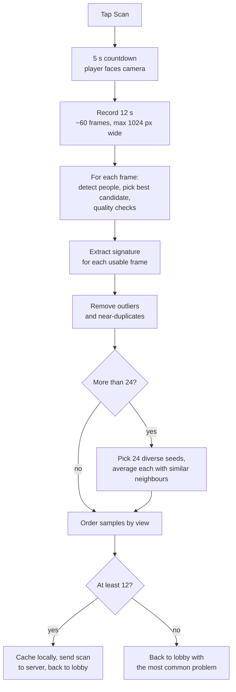

# Scanning (enrolment)

Before a round, every player is scanned so the other phones can recognise them. A scan produces a **gallery**: 12 to 24 appearance [signatures](identification.md#signatures), each from a different viewing angle. The gallery is uploaded to the server and shared with every phone in the room.

The code lives in the *Scan screen* section of `public/app.js`. Signature extraction itself is in [`identify.js`](identification.md).

## Who scans whom

Any phone can scan any player: each lobby row has a **Scan** button, and the gallery is saved under that player's id (`{type: 'scan', targetId, gallery}`). Usually players pair up and scan each other. The server refuses scans while a round is in countdown or playing.

## Pipeline

### 1. Countdown

`runAutoScan()` shows a 5-second countdown so the player can get into position.

### 2. Recording

`recordRotationVideo()` grabs a frame roughly every 180 ms for 12 seconds and keeps each one as an in-memory canvas, scaled to at most 1024 px wide. Nothing is analysed yet, so recording stays smooth even on slow phones.

### 3. Per-frame analysis

`processRotationVideo()` goes through the recorded frames one per animation frame (so the UI stays responsive and shows progress):

1. `detectScanPeople()` finds candidate boxes (object detector + pose; see [Detection](detection.md#detection-functions)).
2. `bestUsableScanCandidate()` scores each box and keeps the best one that passes every check below. If none pass, it records the problem of the best-looking box.
3. For the chosen box, `extractSignature()` builds a signature and a 48×64 thumbnail is cropped.

| Check | Problem code | Rule |
| --- | --- | --- |
| Size | `too-far` | Box height under 18% of the frame, or width under 2.5% |
| Shape | `partial-body` | Height/width ratio outside 0.65–7.0 |
| Framing | `edge-clipped` | Box touches a frame edge and is under 42% of frame height |
| Detector confidence | `low-confidence` | Score below 0.16 |
| Brightness | `low-light` / `overexposed` | Mean brightness below 0.08 or above 0.94 |
| Contrast | `low-contrast` | Brightness standard deviation below 0.025 |
| Sharpness | `motion-blur` | Mean neighbouring-pixel difference below 0.0035 |

Candidate quality favours boxes that are large, tall, near the centre, confidently detected, contrasty and sharp.

### 4. Sample selection

`selectRotationSamples()` turns maybe 40–60 usable frames into a compact, varied gallery. "Similarity" here is the mean cosine similarity of the upper-body, lower-body and grid features.

1. **Remove outliers** (if more than 12 candidates): drop frames whose 4 most similar neighbours average below 0.36 similarity. These are usually a different person or a bad detection.
2. **Remove near-duplicates**: drop frames at least 0.992 similar to a better-quality frame already kept.
3. **If more than 24 remain**: greedily pick 24 seeds, trading off quality against difference from seeds already picked. Each seed is then averaged with up to 3 other frames at least 0.74 similar to it, which smooths out per-frame noise.
4. **Order by view**: start with the best-quality sample and repeatedly append the most similar remaining one. This roughly reconstructs the rotation order, which makes the thumbnails easier to read.

### 5. Result

- **12 or more samples:** the gallery is cached in `localStorage`, sent to the server, and the phone returns to the lobby with *"Saved scan for <name> with N angles."*
- **Fewer than 12:** the phone returns to the lobby with *"Only got N/12 usable angles from U/T frames: <hint>. Try again slower."* The hint comes from the most frequent problem code. The player-facing list of hints is in [How to play](../how-to-play.md#scanning-a-player).

## Local cache

Every scan is cached under `laser-tag:scan:<room>:<lower-cased name>`. When you join, your own cached scan for that room and name is sent with the `join` message, so you're already scanned. The cache is ignored if `SCAN_CACHE_VERSION` changed or the sample count is outside 12–24.

## Server-side limits

The server keeps at most 24 samples per gallery and truncates each feature vector to a fixed length. See [Protocol → Gallery format](../server/protocol.md#gallery-format).

## Tuning

All scan constants (`SCAN_*`, `ROTATION_*`) are at the top of `app.js`. See [Configuration → Scanning](../development/configuration.md#scanning).
