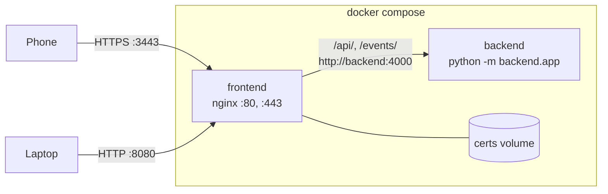

# Docker setup

`docker compose up --build` runs the game as two containers. A third service runs the tests on demand.



## Services

### `backend`

| | |
| --- | --- |
| Dockerfile | `backend/Dockerfile` |
| Base image | `python:3.12-slim` |
| Installs | `backend/requirements.txt` (`aiohttp==3.10.11`) |
| Runs | `python -m backend.app` on port 4000 |
| Exposed | Only inside the Compose network. Not published to the host. |
| Restart | `unless-stopped` |
| Healthcheck | `python -c` requesting `GET /` (the `health` route in `backend/app.py`), every 5 s |

### `frontend`

| | |
| --- | --- |
| Dockerfile | `frontend/Dockerfile` (two stages) |
| Stage 1 | `node:22-bookworm-slim`: `npm ci --omit=dev`, only to get the browser runtimes (`@mediapipe/tasks-vision`, `onnxruntime-web`) onto disk |
| Stage 2 | `nginx:1.27-alpine` plus `openssl` |
| Serves | `frontend/public/` at `/`, MediaPipe's files at `/vendor/tasks-vision/`, and ONNX Runtime Web at `/vendor/ort/` (needed by [`reid.js`](../client/identification.md#the-re-identification-embedding-reidjs)) |
| Ports | `8080 → 80` (HTTP), `3443 → 443` (HTTPS) |
| Volume | `certs` mounted at `/certs` |
| Restart | `unless-stopped` |
| Healthcheck | `openssl x509 -checkend 86400` on the cert, plus `wget` on `http://127.0.0.1/` |
| Waits for | `backend` to be **healthy**, not merely started |

### Restart policies and readiness

Both runtime services are `restart: unless-stopped`. Nothing but a CI deploy ever starts this stack, and CI only runs on a push to `dev`, so before this a host reboot, a daemon restart or an OOM kill took the game down until a human noticed and redeployed.

`frontend` waits on `depends_on: backend: {condition: service_healthy}`. The short list form (`depends_on: [backend]`) waits only for the container to be *created and started* — not for aiohttp to be listening — so every deploy had a window where nginx was up and `backend:4000` refused the connection and both `/api/` and `/events/` answered **502**. For a phone mid-game that is its poll loop and its SSE stream failing at the same moment.

The backend probe uses `python -c` rather than `curl`: `python:3.12-slim` has neither `curl` nor `wget`, and adding one means a new apt layer to carry a request the interpreter can already make. It requests `GET /`, which `backend/app.py` routes to `health()`; nginx proxies only `/api/` and `/events/`, so that route stays unreachable from outside and needs no auth. `test/deploy-robustness.test.js` cross-checks the probe's URL path against the route in `app.py`, so moving the route fails the suite instead of the deploy.

The frontend probe re-checks the certificate's expiry as well as nginx's liveness. The entrypoint renews on start, so this is what catches a container that has been up long enough to outlive its own certificate without ever re-running the entrypoint.

### `tests`

Uses the `test` profile, so `docker compose up` doesn't start it. Run it explicitly:

```bash
docker compose run --rm tests
```

It mounts the repo into a `node:22-bookworm-slim` container, masks `node_modules` with an empty `test-node-modules` volume (so it never touches your host folder), and runs `npm test`. See [Testing](../development/testing.md).

There is deliberately **no `npm ci`**. No test in the suite resolves a bare specifier — the two dependencies exist only to be copied into the frontend image by its `deps` stage — so `npm ci` downloaded ~180 MB of MediaPipe and ONNX Runtime that nothing imported. It also deletes `node_modules` before installing, so the volume cached nothing between runs either. Dropping it takes the network off the path to running the tests. `test/deploy-robustness.test.js` asserts both halves of that: no install in the command, and no bare import anywhere in the suite — so if a test ever does need a dependency, the suite says so instead of the run mysteriously failing.

`backend-tests` is the Python half, and `scripts/test.ps1` runs both and checks both exit codes.

## nginx

`frontend/nginx.conf` defines two identical server blocks, one on port 80 and one on 443 with TLS. Both include `frontend/common-locations.conf`:

| Location | Behaviour |
| --- | --- |
| `/models/` | The four model files, `application/octet-stream`. **Cacheable** — `public, max-age=300` plus an ETag. Uses the `^~` modifier (see the warning below). Never compressed. |
| `/vendor/` | The pinned MediaPipe and ONNX Runtime files. **Cacheable** — `public, max-age=86400` plus an ETag. A `types` block inside restates `.mjs` → `text/javascript` and `.wasm` → `application/wasm`. Also `^~`. |
| `*.mjs` | Served as `text/javascript`. Browsers refuse to load a module script with the wrong MIME type. Now only matches **outside** `/vendor/`, i.e. app-owned modules, and stays `no-store`. |
| `*.wasm` | Served as `application/wasm`, needed for WebAssembly streaming compilation. Also only matches outside `/vendor/`, and stays `no-store`. |
| `*.task`, `*.tflite` | Served as `application/octet-stream`, `no-store`. Dead in practice now that every model lives under `/models/`; kept so a model dropped somewhere else gets the safe default rather than silently being cached. |
| `/api/` | Proxied to `http://backend:4000`, buffering off, **gzip off**, 60 s read timeout (polls are held for up to 20 s), `client_max_body_size 2m` so a gallery upload with re-identification embeddings (~210 KB) has room to spare |
| `/events/` | Proxied to the backend, buffering and caching off, **gzip off**, 1 h read timeout for long-lived SSE streams |
| `/` | Static files — the app shell. `no-store`, ETags off. |

> **Careful with `/models/` and `/vendor/`:** both need the `^~` modifier. nginx tries regex
> locations *before* prefix ones, so plain `location /models/` would lose to the `\.tflite$`
> and `\.task$` regexes further down the file and the models would quietly go back to
> `no-store`. `test/asset-delivery.test.js` asserts the modifier is still there.

### Caching policy, and why the app shell is the exception

Two tiers, split **by path rather than by file extension**:

- **The app shell stays `no-store`** — `index.html`, `app.js`, `style.css` and the app's own
  modules. Deploys are `git pull && docker compose up --build -d` with no filename hashing
  anywhere, so a cached shell would leave phones running yesterday's client against today's
  backend. These files are tiny (the largest, `identify.js`, is 52 KB and 17 KB gzipped), so
  refetching them every load costs almost nothing. **Do not "optimise" this.**
- **The models and the vendor runtimes are cached.** They are the ~18 MB (models) plus
  11–14 MB (WASM) that used to be re-downloaded on *every* page load, reload and rejoin.

The split has to be by path because `.mjs` and `.wasm` are used by both sides: the vendor
bundle under `/vendor/`, and potentially the app's own modules. A rule keyed on the
extension would cache the app's own code and break the deploy.

**How a model update reaches a player who has already played.** This is the reason the
policy revalidates instead of using `immutable`. Models are committed under fixed names and
replaced *in place*, so the URL never changes; under
`Cache-Control: immutable, max-age=31536000` a retuned model would never reach a phone that
had already loaded the old one — for up to a year, with no recovery short of clearing site
data. Detection tuning is active work here, so that is a live hazard, not a theoretical one.
With a short freshness window plus an ETag instead:

- reloads inside the window cost **zero requests and zero bytes**;
- after it, each model is one conditional request answered with a **304 of a few hundred
  bytes** — so the 18 MB transfer is gone either way;
- a replaced model propagates on its own **within ~5 minutes** of the redeploy.

A 304 on 18 MB captures essentially the whole win of `immutable`, so there is no reason to
trade correctness away for it. `/vendor/` gets a longer day-long window because those files
only move when `package-lock.json` does and the image is rebuilt.

One wrinkle worth knowing: nginx derives a static file's ETag from its mtime and size, and
`COPY` preserves mtimes from the build context. A pull that does not touch the model files
leaves their mtimes alone, so ETags stay stable across redeploys — but a *fresh clone* gives
every file a new mtime, so the first load after building on a new machine refetches in full.

### Compression

`gzip on` at server scope, `gzip_comp_level 1`, `gzip_min_length 1024`, `gzip_vary on`, and a
`gzip_types` list covering text, CSS, JS/`.mjs`, JSON, SVG and **`application/wasm`**.
`text/html` is always included by nginx and cannot be listed or removed.

Which types to compress was measured on this repo's actual payload rather than assumed —
`.tflite`/`.task` are FlatBuffer containers and `.onnx` is protobuf, so the weights inside
are already entropy-dense:

| File | Raw | gzip -9 | Saving |
| --- | --- | --- | --- |
| `vendor/ort/ort-wasm-simd-threaded.wasm` | 14,239,897 | 3,659,955 | **74.3%** |
| `vendor/tasks-vision/wasm/vision_wasm_internal.wasm` | 11,153,617 | 3,277,471 | **70.6%** |
| `vendor/tasks-vision/vision_bundle.mjs` | 136,993 | 39,652 | **71.1%** |
| `models/pose_landmarker_lite.task` | 5,777,746 | 4,969,689 | 14.0% |
| `models/osnet_x0_25_msmt17.onnx` | 891,543 | 766,910 | 14.0% |
| `models/efficientdet_lite0.tflite` | 7,254,339 | 6,307,550 | 13.1% |
| `models/mobilenet_v3_small_embedder.tflite` | 4,117,670 | 3,793,283 | 7.9% |
| *all four models together* | *18,041,298* | *15,837,432* | *12.2%* |

So **the WASM runtimes, not the models, are where compression pays** — they are individually
bigger than all four models combined and shrink by about 70%. The models are deliberately
left out of `gzip_types` (which is why `application/octet-stream` is absent from the list):
7.9–14.0% is not worth 115–179 ms of CPU per request, and caching already removes the repeat
transfers.

`gzip_comp_level` stays at nginx's default **1** on purpose. On the ORT WASM, level 1 gives
69.6% for 128 ms of CPU where level 9 gives 74.3% for 716 ms — five times the cost for five
points. Measured transfer through nginx at level 1: **14,239,897 → 4,334,127 bytes.**

`gzip_static` and pre-compressed `.gz` files were considered and **not** used: the saving is
already captured at level 1, `gzip_proxied` is left off so nothing proxied is touched, and
adding a build step plus ~7 MB of duplicate payload to the image is not worth it for a cost
that is now paid once per device rather than once per request.

### The realtime paths must stay uncompressed

`/events/` is the SSE game event stream and `/api/` holds long polls open for ~20 s.
Compressing either means buffering it, which is exactly what must not happen. Three things
keep them safe:

1. `gzip off;` inside **both** location blocks, explicitly.
2. `gzip_proxied` is left at its default of `off`, so proxied responses are never compressed
   regardless — adding `gzip_proxied any` later still cannot break them, because of (1).
3. `proxy_buffering off` is unchanged, and the backend also sends `X-Accel-Buffering: no`.

Verified end to end against the real backend: the SSE response carries **no
`Content-Encoding`** and its first payload byte arrives in **0.68 ms** while the stream stays
open, and `/api/poll` returns `application/json` with no `Content-Encoding`.
`test/asset-delivery.test.js` fails if either `gzip off` or `proxy_buffering off` is removed.

### No preload hints

`<link rel="preload">` for the models was considered and deliberately left out. The WASM
cannot be preloaded at all: MediaPipe builds the path at runtime after probing for SIMD
support —

```
wasmBinaryPath: `${dir}/${task}_wasm${module ? "_module" : ""}${simd ? "" : "_nosimd"}_internal.wasm`
```

— so a static hint would have to guess among four variants, and guessing wrong means an
11 MB download a phone never uses. For the models, `as="fetch"` has to match the eventual
request's CORS and credentials mode or the browser fetches twice, which on a 7.25 MB file
would be worse than the problem being solved. The right mechanism is an explicit `fetch()`
warm-up in the client, where load order and priority are already being decided; see
[detection](../client/detection.md).

### Verifying a change to this config

Config mistakes here fail *hard* — an invalid directive stops nginx from starting, which
takes the whole frontend down on deploy. `if_modified_since on` is a real example: it looks
right, and nginx rejects it (the valid values are `off`, `exact`, `before`). So always:

```bash
docker compose build frontend
docker compose up -d
docker compose exec frontend nginx -t

# models: long-lived, with an ETag, and NOT compressed
curl -sI -H 'Accept-Encoding: gzip' http://localhost:8080/models/efficientdet_lite0.tflite
# the app shell: must still say no-store
curl -sI http://localhost:8080/index.html
# the vendor WASM: cached and gzipped
curl -sI -H 'Accept-Encoding: gzip' http://localhost:8080/vendor/ort/ort-wasm-simd-threaded.wasm
# the SSE stream: no Content-Encoding, and bytes arrive immediately
curl -sN -D - --max-time 2 http://localhost:8080/events/testroom
```

`npm test` also runs `test/asset-delivery.test.js`, which checks the shipped config as text —
no Docker needed, so it runs on a laptop. It cannot prove nginx *accepts* the file, which is
what `nginx -t` above is for; it pins the policy decisions so they are not quietly undone.

## TLS certificate

`frontend/entrypoint.sh` runs before nginx starts. It generates a self-signed RSA-2048 certificate valid for 365 days, then starts nginx in the foreground.

It regenerates when **any** of these is true, which is the part that used to be wrong:

| Condition | Why |
| --- | --- |
| either file is missing or empty | the original case |
| the cert expires within 30 days | the old guard tested only *existence*. With `-days 365`, on day 366 nginx still started and still served 443 — with an expired certificate, which mobile browsers refuse far less forgivingly than an untrusted-but-valid one, and nothing reported it |
| the cert does not parse | `openssl x509 -checkend` exits non-zero on an unparseable file as well as a near-expired one, so this comes free |
| the key does not parse | a truncated *key* is invisible to a check on the cert, and nginx needs both |
| `CERT_HOSTS` changed since the cert was written | otherwise editing it would silently do nothing for the life of the volume |

Generation writes to `/certs/.cert.pem.new` and `/certs/.key.pem.new` and `mv`s both into place. `rename(2)` within the volume is atomic, so a container killed mid-`openssl` leaves the previous usable pair rather than a truncated file. (Before this, a kill mid-write left two files that satisfied the existence guard forever, after which nginx failed to start on *every* boot with no fix but `docker volume rm`.)

### subjectAltName

The certificate carries a `subjectAltName`, not just `CN=laser-tag.local`. Modern browsers ignore `commonName` entirely, so the old cert failed hostname validation from the day it was generated — and a browser exception only sticks for a name the certificate actually claims.

The default is `DNS:laser-tag.local,DNS:localhost,IP:127.0.0.1`. **For LAN play, set `CERT_HOSTS` to include the host's LAN address**, because that is what a phone actually types and it is not knowable at build time:

```yaml
# docker-compose.yml, under the frontend service
environment:
  CERT_HOSTS: DNS:laser-tag.local,DNS:localhost,IP:127.0.0.1,IP:192.168.1.20
```

Changing it regenerates on the next start; no need to remove the volume.

Because `/certs` is a named volume, the certificate survives `docker compose down` and rebuilds, and phones only need to accept it once. To force a new certificate by hand:

```bash
docker compose down
docker volume ls | grep certs          # find the volume, e.g. laser-tag_certs
docker volume rm laser-tag_certs
docker compose up --build
```

`docker compose down -v` also works, but it removes the test `node_modules` volume too.

## Line endings

`.gitattributes` forces LF line endings for `*.sh`, `*.conf`, `Dockerfile` and `*.yml`/`*.yaml`. A Windows checkout with CRLF endings would otherwise break `entrypoint.sh` inside the Linux container. The frontend Dockerfile also strips `\r` from `entrypoint.sh` as a second safeguard.

`*.yml` matters for the same reason one step removed: the deploy workflow holds shell inside a `run: |` block, so CRLF would put a `\r` at the end of every line of it and the VM would be asked to run `git checkout dev\r` — which fails in a way that reads as a git problem, not a line-ending one.

The model files (`*.tflite`, `*.task`, `*.onnx`, `*.wasm`) are pinned `binary`, so no future `text=auto` can rewrite bytes inside a FlatBuffer or protobuf container and corrupt a model with no visible diff.

## Build context

Both images build from the repo root (`context: .`).

`.dockerignore` patterns are matched against each path in the context, and **a pattern with no separator matches only at the top level**. A bare `node_modules` therefore missed every nested copy — including `.claude/worktrees/*/node_modules`, and `.claude/` is ~1 GB on a machine with agent worktrees (15 × ~181 MB). The context went from ~45 MB to ~1 GB. That is local build speed only, since `.gitignore` keeps `.claude/` off the VM, but every local `docker compose build` paid it. Hence `**/node_modules`, `.claude/` and `**/.git`.

`**/__pycache__`, `**/*.pyc` and `backend/test_*.py` are excluded for a different reason: `backend/Dockerfile` is `COPY backend/ ./backend/`, so the production image was shipping the test files plus 176 KB of **cpython-314** bytecode into a `python:3.12-slim` image, where it is not even loadable. `frontend/public/*.test.js` likewise — `COPY frontend/public/ /usr/share/nginx/html/` published it, and `GET /identify.test.js` answered **200** on the production origin (measured).

None of that stops anyone running the tests: both test services bind-mount the repo (`.:/app`), and `.dockerignore` does not apply to bind mounts.

What is deliberately *not* excluded is `test/`, `tools/`, `docs/`, `scripts/` and `.github/`. They are a few MB next to the entries above, and a blanket exclusion is exactly the kind of thing that makes a future `COPY test/ ...` copy nothing at all with no error.


## Cross-origin isolation

`frontend/cross-origin-isolation.conf` serves three headers from every static location:

| Header | Value |
| --- | --- |
| `Cross-Origin-Opener-Policy` | `same-origin` |
| `Cross-Origin-Embedder-Policy` | `require-corp` |
| `Cross-Origin-Resource-Policy` | `same-origin` |

**Why.** `reid.js` requests `min(4, hardwareConcurrency)` WASM threads for OSNet, but only when
`globalThis.crossOriginIsolated` — which the browser sets only if the document arrived with COOP
*and* COEP, because that is the precondition for handing out `SharedArrayBuffer`. Nothing served
them before, so that branch had never executed: OSNet ran on one thread on every device, and the
`ort-wasm-simd-threaded.wasm` build in the image was doing the non-threaded build's job. OSNet is
the most expensive inference in the app and dominates the end of every scan.

**Why it is a separate file included seven times, rather than one `add_header` at server level.**
nginx inherits `add_header` from an outer level *only if the current level declares no
`add_header` of its own*. Every static block in `common-locations.conf` sets its own
`Cache-Control`, so a server-level COOP/COEP would be silently discarded in exactly the blocks
that serve the document — no error, no warning, and `crossOriginIsolated` quietly false. A test
asserts the include is present in every non-proxied location.

**Why `require-corp` and not `credentialless`.** `credentialless` avoids the cross-origin opt-in
requirement, but Safari does not implement it and this game is played on phones. `require-corp`
has been supported since Safari 15.2.

**The constraint this imposes.** Under `require-corp`, every *cross-origin* subresource must opt
in via CORP or CORS or it is blocked outright — a blank screen, not a degraded one. It is safe
here only because the client loads nothing cross-origin: no CDN, no web font, no analytics.
`index.html` references `style.css` and `app.js`; models come from `/models/`, runtimes from
`/vendor/`, and `/api/` and `/events/` are same-origin through this same nginx. The camera is a
`MediaStream`, not a fetched subresource, so it is unaffected. **Before adding any third-party
resource, give it CORP/CORS or self-host it** — do not relax the header. A test fails if
`index.html` gains an absolute `src`/`href`.

`/api/` and `/events/` are deliberately excluded: they answer `fetch()` and `EventSource`, not
documents, so isolation does not apply to them.

**Failure is one-directional**, which is what makes this safe to ship without a device: if
isolation does not take effect, `crossOriginIsolated` is false and `reid.js` falls back to one
thread — today's behaviour. There is no path where this is slower.

**Verified** with nginx 1.30.5 against the unmodified shipped configs: `nginx -t` passes, and on
the wire `index.html`, `app.js` and `/models/*` all carry the three headers while `/api/` carries
none. **Not verified:** the `nginx:1.27-alpine` image specifically, and the real thread count on a
phone — `?debug` reports it.

## Common commands

```bash
docker compose up --build              # build and run in the foreground
docker compose up --build -d           # run in the background
docker compose logs -f backend         # follow backend logs
docker compose ps                      # what's running
docker compose down                    # stop and remove containers (keeps the cert)
docker compose run --rm tests          # run the test suite
```

On Windows, `scripts/docker.ps1` and `scripts/test.ps1` wrap these. See [Windows helper scripts](windows-scripts.md).
