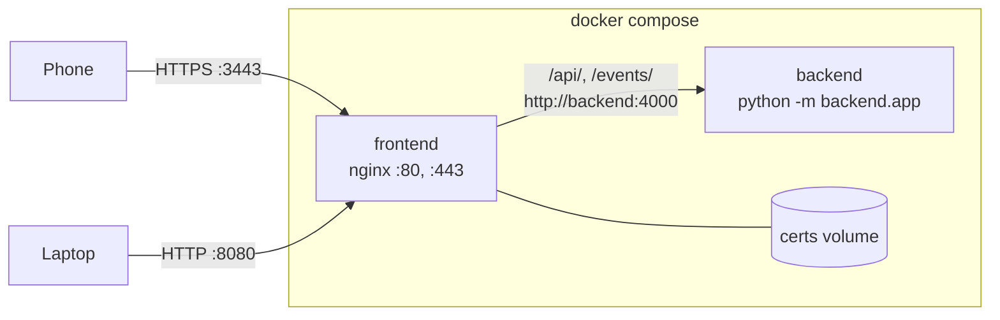

# Docker setup

`docker compose up --build` runs the game as two containers. A third service runs the tests on demand.



## Services

### `backend`

| | |
| --- | --- |
| Dockerfile | `backend/Dockerfile` |
| Base image | `python:3.12-slim` |
| Installs | `backend/requirements.txt` (`aiohttp==3.10.11`) |
| Runs | `python -m backend.app` on port 4000 |
| Exposed | Only inside the Compose network. Not published to the host. |

### `frontend`

| | |
| --- | --- |
| Dockerfile | `frontend/Dockerfile` (two stages) |
| Stage 1 | `node:20-bookworm-slim`: `npm ci --omit=dev`, only to get `@mediapipe/tasks-vision` onto disk |
| Stage 2 | `nginx:1.27-alpine` plus `openssl` |
| Serves | `public/` at `/`, and MediaPipe's files at `/vendor/tasks-vision/` |
| Ports | `8080 → 80` (HTTP), `3443 → 443` (HTTPS) |
| Volume | `certs` mounted at `/certs` |

### `tests`

Uses the `test` profile, so `docker compose up` doesn't start it. Run it explicitly:

```bash
docker compose run --rm tests
```

It mounts the repo into a `node:20-bookworm-slim` container, keeps `node_modules` in its own `test-node-modules` volume (so it never touches your host folder), and runs `npm ci && npm test`. See [Testing](../development/testing.md).

## nginx

`frontend/nginx.conf` defines two identical server blocks, one on port 80 and one on 443 with TLS. Both include `frontend/common-locations.conf`:

| Location | Behaviour |
| --- | --- |
| `*.mjs` | Served as `text/javascript`. Browsers refuse to load a module script with the wrong MIME type. |
| `*.wasm` | Served as `application/wasm`, needed for WebAssembly streaming compilation |
| `*.task`, `*.tflite` | Served as `application/octet-stream` |
| `/api/` | Proxied to `http://backend:4000`, buffering off, 60 s read timeout (polls are held for up to 20 s) |
| `/events/` | Proxied to the backend, buffering and caching off, 1 h read timeout for long-lived SSE streams |
| `/` | Static files |

Every static response carries `Cache-Control: no-store` with ETags disabled, so phones always get the latest client after a redeploy. The trade-off is that the ~17 MB of models are downloaded again on every page load.

## TLS certificate

`frontend/entrypoint.sh` runs before nginx starts. If `/certs/cert.pem` or `/certs/key.pem` is missing, it generates a self-signed RSA-2048 certificate for `CN=laser-tag.local`, valid for **365 days**. Then it starts nginx in the foreground.

Because `/certs` is a named volume, the certificate survives `docker compose down` and rebuilds, and phones only need to accept it once. To force a new certificate (for example after it expires):

```bash
docker compose down
docker volume ls | grep certs          # find the volume, e.g. laser-tag_certs
docker volume rm laser-tag_certs
docker compose up --build
```

`docker compose down -v` also works, but it removes the test `node_modules` volume too.

## Line endings

`.gitattributes` forces LF line endings for `*.sh`, `*.conf` and `Dockerfile`. A Windows checkout with CRLF endings would otherwise break `entrypoint.sh` inside the Linux container. The frontend Dockerfile also strips `\r` from `entrypoint.sh` as a second safeguard.

## Build context

Both images build from the repo root (`context: .`). `.dockerignore` excludes `node_modules`, `.git`, `.certs`, logs and editor folders.

## Common commands

```bash
docker compose up --build              # build and run in the foreground
docker compose up --build -d           # run in the background
docker compose logs -f backend         # follow backend logs
docker compose ps                      # what's running
docker compose down                    # stop and remove containers (keeps the cert)
docker compose run --rm tests          # run the test suite
```

On Windows, `scripts/docker.ps1` and `scripts/test.ps1` wrap these. See [Windows helper scripts](windows-scripts.md).
