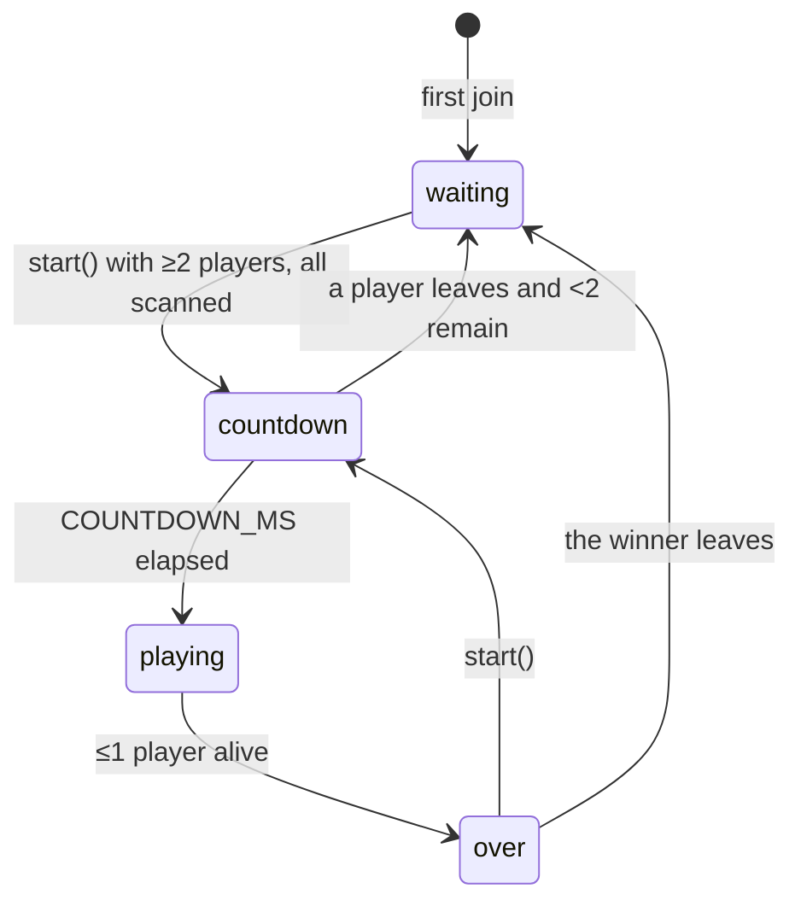

# Game rules and room lifecycle

The rules live in a `Room` class with no networking, implemented twice with the same behaviour:

- `server/game.js` (Node, unit-tested in `server/game.test.js`)
- the `Room` class in `backend/app.py` (Python, used in production)

## Constants

| Constant | Value | Meaning |
| --- | --- | --- |
| `MIN_PLAYERS` | 2 | Players needed to start a round |
| `MAX_PLAYERS` | 8 | Room capacity |
| `MAX_HP` | 100 | Starting HP each round |
| `DAMAGE.body` | 20 | Body hit damage |
| `DAMAGE.head` | 50 | Headshot damage |
| `SHOT_COOLDOWN_MS` | 350 | Minimum time between a player's accepted shots |
| `COUNTDOWN_MS` | 3000 (Node) / 5000 (Python) | Countdown before a round starts |

> The two implementations currently disagree on `COUNTDOWN_MS`: `server/game.js` has 3000, `backend/app.py` has 5000, and the client's local countdown mirrors the Node value. Phones self-correct from the server's `startsInMs`, so nothing breaks, but the number should be the same in all three. See [Configuration → Game rules](../development/configuration.md#game-rules).

## Room states

| Status | Join? | Scan? | Shoot? | Start? |
| --- | --- | --- | --- | --- |
| `waiting` | Yes | Yes | No | Yes |
| `countdown` | No: *"Lobby is already running."* | No | No: *"Round not running"* | No |
| `playing` | No: *"Lobby is already running."* | No | Yes | No |
| `over` | Yes | Yes | No | Yes |

There's no timer that moves `countdown` to `playing`. Instead `update()` checks the clock whenever state is read or a shot arrives. The server also schedules one extra state broadcast for the moment the countdown ends, so every phone flips to *playing* together.

## Operations

### `join(id, name, gallery)`

Adds a player with full HP, 0 wins and the given gallery (possibly empty). Fails if a round is running or the room is full.

### `setGallery(id, gallery)`

Stores a player's scan. Fails during a round, for an unknown player, or for an empty gallery. Also copies the gallery between a player and their [debug clone](#debug-clones).

### `start()`

Any player can start. Fails if a round is already running, there are fewer than 2 players, or anyone (other than debug clones) has no scan. The error names up to three unscanned players: *"Scan everyone before launch: Alice, Bob +2"*. On success it resets everyone to full HP, clears the winner and begins the countdown.

### `shoot(shooterId, targetId, zone)`

Checks, in this order:

1. Both players exist: *"Unknown player"*.
2. Not shooting yourself: *"Can't target yourself"*.
3. Round is playing: *"Round not running"*.
4. Both alive: *"Target is down"*.
5. `zone` is `body` or `head`: *"Unknown zone"*.
6. Shooter's cooldown has passed: *"Cooldown"*.

Then it subtracts damage (never below 0). At 0 HP the target is knocked out, and if at most one player is still alive the round ends.

The server trusts the shooter's phone about *who* was hit and *where*. See [Architecture](../architecture.md#data-flow-for-one-shot).

### Winning

`finishIfDecided()` runs after each knockout and departure. With one survivor, that player wins and their `wins` counter goes up. With none (only possible if players leave), the round ends with no winner. Wins persist across rounds for as long as the player stays in the room.

### `leave(id)`

Removes the player, then:

- **playing:** checks whether the round is now decided;
- **countdown:** resets to `waiting` if fewer than 2 players remain;
- **over:** resets to `waiting` if the winner left (or there was none).

The surrounding server deletes a room once it's empty.

## Snapshot and roster

The server sends two views of a room, so the big gallery data isn't resent on every shot:

- `snapshot()`: the frequently-sent state (status, countdown, winner, limits, and each player's id, name, HP, wins, alive). Sent after every change.
- `roster()`: each player's id, name and gallery. Sent only when membership or scans change.

Exact formats: [Protocol](protocol.md#server--client-messages).

## Debug clones

A player who joins with `debug: true` gets a second player with id `<id>:debug-clone` and name `<name> clone`. The clone:

- always mirrors its owner's gallery, in both directions;
- doesn't need its own scan to start a round;
- can be shot, so one person can test a full round;
- leaves when its owner leaves.

A debug join needs two free slots. See [Debug mode](../development/debug-mode.md).
