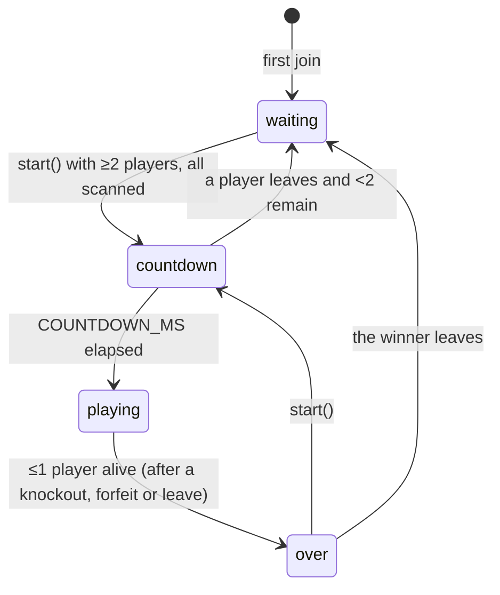

# Game rules and room lifecycle

The rules live in a `Room` class with no networking, in `backend/models.py` (Python - the only
backend; see [Streamlining → Two complete backend implementations](../streamlining.md) for the
Node implementation this replaced, archived under `deprecated/server/`).

## Constants

| Constant | Value | Meaning |
| --- | --- | --- |
| `MIN_PLAYERS` | 2 | Players needed to start a round |
| `MAX_PLAYERS` | 8 | Room capacity |
| `MAX_HP` | 100 | Starting HP each round |
| `DAMAGE.body` | 20 | Body hit damage |
| `DAMAGE.head` | 50 | Headshot damage |
| `SHOT_COOLDOWN_MS` | 350 | Minimum time between a player's accepted shots |
| `COUNTDOWN_MS` | 3000 | Countdown before a round starts |

## Room states

| Status | Join? | Scan? | Shoot? | Start? |
| --- | --- | --- | --- | --- |
| `waiting` | Yes | Yes | No | Yes |
| `countdown` | No: *"Lobby is already running."* | No | No: *"Round not running"* | No |
| `playing` | No: *"Lobby is already running."* | No | Yes | No |
| `over` | Yes | Yes | No | Yes |

There's no timer that moves `countdown` to `playing`. Instead `update()` checks the clock whenever state is read or a shot arrives. The server also schedules one extra state broadcast for the moment the countdown ends, so every phone flips to *playing* together.

## Operations

### `join(id, name, gallery)`

Adds a player with full HP, 0 wins and the given gallery (possibly empty). Fails if a round is running or the room is full.

### `setGallery(id, gallery)`

Stores a player's scan. Fails during a round, for an unknown player, or for an empty gallery. Also copies the gallery between a player and their [debug clone](#debug-clones).

### `start()`

Any player can start. Fails if a round is already running, there are fewer than 2 players, or anyone (other than debug clones) has no scan. The error names up to three unscanned players: *"Scan everyone before launch: Alice, Bob +2"*. On success it resets everyone to full HP, clears the winner and everyone's [round stats](#round-stats), and begins the countdown.

### `shoot(shooterId, targetId, zone)`

`targetId` of `null` is a **miss**: the shooter fired at nobody. Checks, in this order:

1. The shooter exists, and so does the target if one is given: *"Unknown player"*.
2. Not shooting yourself: *"Can't target yourself"*.
3. Round is playing: *"Round not running"*.
4. Shooter is alive: *"You are down"*.
5. With a target, `zone` is `body` or `head`: *"Unknown zone"*.
6. Shooter's cooldown has passed: *"Cooldown"*.

A shot that passes counts as fired. A miss, or a shot at a player who is already down (the shooter's phone hadn't heard yet), returns `{ok: true, hit: false}` and changes nothing else. A hit subtracts damage (never below 0). At 0 HP the target is knocked out, and if at most one player is still alive the round ends.

The server trusts the shooter's phone about *who* was hit and *where*. See [Architecture](../architecture.md#data-flow-for-one-shot).

### Winning

`finishIfDecided()` runs after each knockout and departure. With one survivor, that player wins and their `wins` counter goes up. With none (only possible if players leave or forfeit), the round ends with no winner. Wins persist across rounds for as long as the player stays in the room.

### Round stats

Each player has a `RoundStats` for the current round, or the last one once it's over. `start()` resets it, so it survives into the `over` state and the [results screen](../client/app-flow.md#results-results), and a reconnect keeps it.

| Stat | Counts |
| --- | --- |
| `kills` | Knockouts by your shots. A forfeit isn't anyone's kill. |
| `damage` | HP you actually took off: a 50-point headshot on a player with 20 HP left counts as 20 |
| `shots` | Every shot the server accepted, misses included. Shots refused by the checks above don't count. |
| `hits` | Shots that took HP off someone. `hits / shots` is accuracy. |
| `headshots` | Hits in the `head` zone |
| `timeAliveMs` | From the moment the countdown ended until you were knocked out or forfeited, or until the round ended if you were still standing. Counts up live during the round. |

They're sent in `snapshot()` as `players[].stats`. A miss doesn't broadcast a `state` of its own, but a player's round can't end without one (their knockout, or the end of the round), so the numbers are complete by the time their results show.

### `leave(id)`

Removes the player, then:

- **playing:** checks whether the round is now decided;
- **countdown:** resets to `waiting` if fewer than 2 players remain;
- **over:** resets to `waiting` if the winner left (or there was none).

The surrounding server deletes a room once it's empty.

### `forfeit(id)`

A deliberate leave (the player tapped *leave*). If the round is `playing` and the player is still alive, it counts as a knockout: HP drops to 0, `alive` becomes false and `forfeited` true, and the round is checked for a winner just as after a shot. The player stays on the scoreboard, shown as down, until the round ends; `finishIfDecided()` then removes every forfeited player. A forfeited seat can't be resumed with `playerId`.

In any other situation (lobby, countdown, already knocked out) it's a plain `leave(id)`.

A phone that just stops polling is **not** forfeited: it is removed with `leave()`, because it might be a dropped connection rather than a choice.

## Snapshot and roster

The server sends two views of a room, so the big gallery data isn't resent on every shot:

- `snapshot()`: the frequently-sent state (status, countdown, winner, limits, and each player's id, name, HP, wins, alive, forfeited and [round stats](#round-stats)). Sent after every change.
- `roster()`: each player's id, name and gallery. Sent only when membership or scans change.

Exact formats: [Protocol](protocol.md#server--client-messages).

## Debug clones

A player who joins with `debug: true` gets a second player with id `<id>:debug-clone` and name `<name> clone`. The clone:

- always mirrors its owner's gallery, in both directions;
- doesn't need its own scan to start a round;
- can be shot, so one person can test a full round;
- leaves when its owner leaves.

A debug join needs two free slots. See [Debug mode](../development/debug-mode.md).
